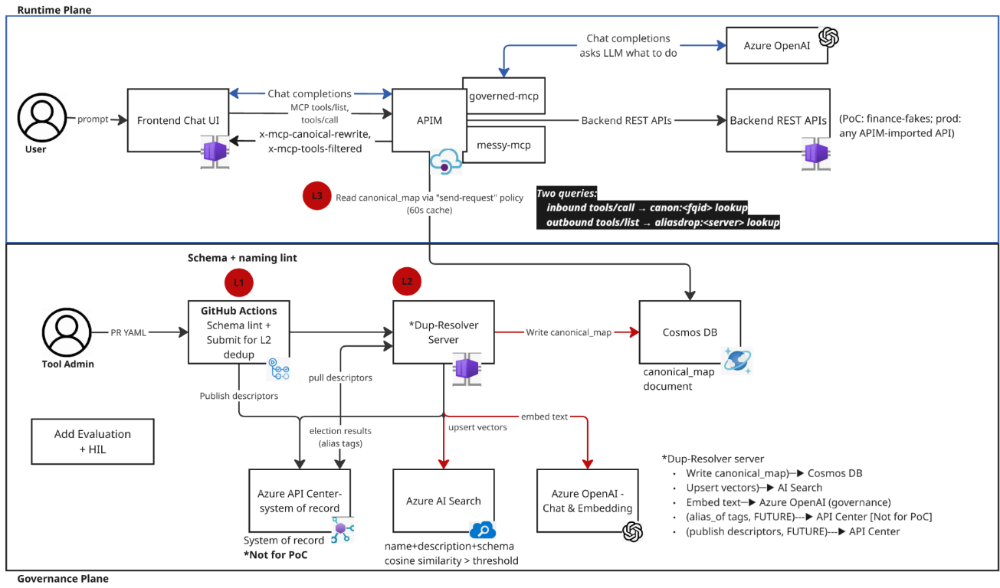

# MCP Tool Governance

Reference implementation for governing MCP (Model Context Protocol) tools
published through Azure API Management. When every REST API becomes an agent
tool, agents choose tools from machine-readable catalogs — not from human
judgment. This repo enforces canonical naming, alias rewriting, JWT
validation, and rate limiting at the APIM edge, with no custom MCP server
containers required.

> For more detail, see Peter Lee's blog article,
> [*When Every API Becomes an Agent Tool: Why MCP Governance Matters*](https://redhatpeter.github.io/posts/when-every-api-becomes-an-agent-tool/).
> This repo is the hands-on reference for the L1/L2/L3 workflow, the
> governed-vs-messy MCP surfaces, and the runtime rewrite/filter pattern
> described there.

## Why this exists

An MCP catalog is interpreted first by a model, not a human. As more APIs are
surfaced as tools, agents face a larger and noisier decision surface, and tool
quality directly affects selection accuracy, wrong-action risk, token cost, and
auditability. Five failure patterns show up as catalogs grow:

1. **Name collisions** — `createCustomer`, `CreateCustomer`, `customer_create`
   all look like valid options to an agent; the wrong one still executes.
2. **Semantic duplicates** — `customer.find` / `customer.search` /
   `customer.lookup` overlap in behavior with no clear distinction in metadata.
3. **Tool overloading & schema drift** — `invoiceCreate` /
   `invoiceCreateV1` / `invoiceCreateLegacy` sound related but their schemas
   diverged, so the agent can send the wrong payload to the wrong version.
4. **Ungrouped / flat namespaces** — `create`, `lookup`, `list`, `update`
   carry no domain signal; `finance_invoice_create` does.
5. **Gateway naming drift** — an operation authored as `finance_quote_get`
   can appear to the agent as `financeQuoteGet` after APIM normalization, so
   policies keyed only on the authored name miss the runtime call.



## Two connected planes

- **Governance plane** — validates, deduplicates, classifies, and
  canonicalizes tools *before* publication (L1 + L2 below).
- **Runtime plane** — decides what the agent actually sees and how
  invocations are normalized, filtered, secured, and observed *at runtime*
  (L3 below), with APIM as the single control point: **govern once at the
  gateway** instead of fixing every MCP server independently.

## Status

PoC complete. **All three layers shipped and live** against the
`apimopenai992` APIM instance + Azure OpenAI + Azure AI Search + Cosmos.

Snapshot of what's running:

| Layer | Where | What |
| --- | --- | --- |
| L1 | [`.github/workflows/validate-mcp-tools.yml`](.github/workflows/validate-mcp-tools.yml) | `tools-cli/lint.py` blocks bad operations at PR time. |
| L2 | [`.github/workflows/similarity-check.yml`](.github/workflows/similarity-check.yml) | `apps/dup-resolver/check_pr.py` embeds new ops, queries `mcp-tool-fingerprints`, posts a 5-tier verdict (DUPLICATE / WARN / REVIEW / OK / INFO) on the PR. Thresholds = repo variables `CLUSTER_THRESHOLD` (`0.92`) + `REVIEW_THRESHOLD` (`0.65`). |
| L2 | [`.github/workflows/ingest-on-merge.yml`](.github/workflows/ingest-on-merge.yml) + [`daily-ingest.yml`](.github/workflows/daily-ingest.yml) | Re-ingest `apim/openapi/*.json` on every push to `main` and nightly; reconciles AI Search + Cosmos `mcp-canonical-map` (deletes stale docs). |
| L3 | [`apim/policies/canonical-rewrite.policy.xml`](apim/policies/canonical-rewrite.policy.xml) + [`tools-list-filter.policy.xml`](apim/policies/tools-list-filter.policy.xml) | Both deployed on `governed-mcp` and `messy-mcp`. Live evidence: `x-mcp-tools-filtered: 3` on `messy-mcp/tools/list`; `x-mcp-canonical-rewrite: createCustomer -> customerCreate` on `tools/call`. |
| CI gate | [`.github/workflows/policy-tests.yml`](.github/workflows/policy-tests.yml) | 6 unit tests (wirename + verdict-tier) + 8 Cosmos contract replays. Latest green: [run 25637828620](https://github.com/redhatpeter/mcp-tool-governance/actions/runs/25637828620). |
| Demo | [`demo/run-demo.sh`](demo/run-demo.sh) | 5-minute push-button walkthrough of the governed-vs-messy surfaces. |

**Known external blocker (not our bug):** APIM-MCP currently forwards only
the last property of `params.arguments` as a raw scalar to the backend
(regression of `release-service-2026-03`). Tracked at
[Azure-Samples/AI-Gateway#315](https://github.com/Azure-Samples/AI-Gateway/issues/315).
Reproduces with all custom policies stripped — the governance layer is innocent.

## Run and test

### Choose a test path

| Goal | Azure required? | Typical time | Start here |
| --- | --- | --- | --- |
| Validate lint and regression logic | No | 2–5 minutes | [Local validation](#1-local-validation) |
| Walk through the CLI demo | Yes — APIM | 5 minutes | [CLI demo](#2-five-minute-cli-demo) |
| Explore the visual comparison | Yes — APIM + Azure OpenAI | 10 minutes | [Streamlit UI](#3-streamlit-ui) |

> [!TIP]
> New contributors should begin with **Local validation**. It is the fastest
> path and does not require Azure credentials.

### 1. Local validation

**Prerequisite:** Python 3.10 or later.

#### Run the L1 catalog lint

From the repository root:

```bash
python3 tools-cli/lint.py --no-warn
```

This checks every managed OpenAPI specification for naming, collision, and
schema-quality problems.

#### Run the L2/L3 regression tests

Create a virtual environment and install the duplicate resolver dependencies:

```bash
python3 -m venv apps/dup-resolver/.venv
apps/dup-resolver/.venv/bin/pip install \
  -r apps/dup-resolver/requirements.txt
```

Run the regression suites:

```bash
AOAI_ENDPOINT=https://placeholder.openai.azure.com \
SEARCH_ENDPOINT=https://placeholder.search.windows.net \
  apps/dup-resolver/.venv/bin/python \
  apps/dup-resolver/tests/test_wirename_resolution.py

AOAI_ENDPOINT=https://placeholder.openai.azure.com \
SEARCH_ENDPOINT=https://placeholder.search.windows.net \
  apps/dup-resolver/.venv/bin/python \
  apps/dup-resolver/tests/test_verdict_tiers.py

AOAI_ENDPOINT=https://placeholder.openai.azure.com \
SEARCH_ENDPOINT=https://placeholder.search.windows.net \
  apps/dup-resolver/.venv/bin/python \
  apps/dup-resolver/tests/test_reconcile.py
```

> [!NOTE]
> The placeholder endpoints only satisfy configuration validation. These
> regression tests do not connect to Azure.

### 2. Five-minute CLI demo

**Prerequisites**

- `bash`, `curl`, and network access to the deployed APIM gateway
- An APIM subscription key stored as raw text in
  `/tmp/apim-master-key.txt`

> [!IMPORTANT]
> Keep the subscription key local. Never commit it to this repository.

Run the interactive walkthrough from the repository root:

```bash
./demo/run-demo.sh
```

The script pauses between each act. To run it without pauses:

```bash
AUTO=1 ./demo/run-demo.sh
```

The L2 semantic-deduplication act uses a local duplicate resolver when
available. Otherwise, it falls back to captured sample data. See
[`demo/README.md`](demo/README.md) for gateway overrides, detailed
prerequisites, and the recovery playbook.

### 3. Streamlit UI

**Prerequisites**

- Access to the deployed APIM and Azure OpenAI resources
- An APIM subscription key
- Azure CLI authenticated with `az login`

Install and launch the UI:

```bash
python3 -m venv frontend/.venv
frontend/.venv/bin/pip install -r frontend/requirements.txt
az login

cd frontend
export APIM_KEY="<your-APIM-subscription-key>"
.venv/bin/streamlit run app.py
```

Then open **<http://localhost:8501>**.

| Setting | When to change it |
| --- | --- |
| `APIM_BASE` | You are using a gateway other than the default |
| `AOAI_ENDPOINT` | You are using a different Azure OpenAI resource |
| `AOAI_DEPLOYMENT` | Your chat-model deployment has a different name |

The L2 similarity tab also requires the duplicate resolver on port `8089`.
See [`frontend/README.md`](frontend/README.md) and
[`apps/dup-resolver/README.md`](apps/dup-resolver/README.md) for its setup and
configuration.

## How it works (L1 / L2 / L3)

- **L1 — Schema & naming lint** ([`tools-cli/lint.py`](tools-cli/lint.py),
  run in [`validate-mcp-tools.yml`](.github/workflows/validate-mcp-tools.yml)).
  The first gate in CI. Checks naming rules, collisions, banned version
  markers, and missing disambiguation guidance so bad tools never enter the
  catalog.
- **L2 — Duplicate resolution** ([`apps/dup-resolver/`](apps/dup-resolver/)).
  Pulls descriptors, embeds and compares tools with Azure OpenAI + Azure AI
  Search, elects a canonical identity, and writes a `canonical_map` into
  Cosmos DB. The PR check posts a 5-tier verdict; ingest reconciles the map
  on merge and nightly.
- **L3 — Runtime enforcement** ([`apim/policies/`](apim/policies/)).
  At runtime APIM reads the canonical map, filters duplicates out of
  `tools/list`, normalizes tool identity for matching, and rewrites aliases
  during `tools/call` — turning governance into an active runtime control
  instead of passive documentation.

In plain English: **L1 prevents bad tools from entering the catalog, L2
decides which tools are really the same capability, and L3 makes the runtime
experience safer for the agent.**

## Rollout path

1. Start with **L1 in CI** so the catalog stops getting worse.
2. Add **L2 in observe-only** mode so duplicate patterns become visible.
3. Enable **L3 gradually by domain** so `tools/list` filtering and alias
   rewrite can be measured safely in production-like conditions.

## Repository layout (actual)

```text
.
├── apim/
│   ├── deploy/            # Python deploy script for L3 policies (idempotent)
│   ├── openapi/           # finance-governed.json + finance-messy.json (the spec source)
│   └── policies/          # L3 policy XML — canonical-rewrite + tools-list-filter
├── apps/
│   └── dup-resolver/      # L2 — embed, cluster, elect, write canonical_map (+ FastAPI for demo)
├── demo/                  # 5-minute push-button walkthrough script
├── eval/                  # before/after harness (governed vs messy, +41.7pp lift, gpt-4o-mini baseline)
├── frontend/              # chat UI for the governed-vs-messy comparison
├── tools-cli/             # L1 lint (tools-cli/lint.py)
└── .github/workflows/     # validate-mcp-tools, similarity-check, ingest-on-merge,
                           # daily-ingest, policy-tests
```

> Not present (and not needed for the PoC): `infra/terraform/`,
> `registry/`, `profiles/`. These are Year-1 investments.

## Key conventions

- **Naming standard:** `domain.entity.action` for canonical IDs,
  `domain_entity_action` for authored operation IDs. Regex
  `^[a-z][a-z0-9_]{2,63}$`.
- **Gateway naming drift:** APIM-MCP normalizes an authored operation ID
  (e.g. `finance_quote_get`) into a camelCase *wire name*
  (`financeQuoteGet`) at runtime. L2 resolves the actual wire name from APIM
  (`apps/dup-resolver/apim_wirenames.py`) so the canonical map is keyed on
  what the agent really calls.
- **Canonical identity:** canonical-map documents are keyed as
  `<server>__<wireName>` (e.g. `governed-mcp__financeQuoteGet`), reconciling
  authored, runtime, and governance identities.
- **Canonical map fields:** `primary` (singular) and `aliases` (plural). Do not
  rename.
- **Runtime governance signal:** the `x-mcp-canonical-rewrite` response header
  is stamped by APIM policy on alias hits and surfaced in App Insights.

## Target Azure environment

Resources used by the reference deployment (substitute your own tenant and subscription):

- APIM: `apimopenai992` (RG `rg_apim`, gateway `https://apimopenai992.azure-api.net`)
- Azure OpenAI: `common-open-ai2` (RG `ml-rg`) — deployments `text-embedding-3-large` and `gpt-4.1-mini`
- Cosmos DB: `cosmoslab826582` (RG `cosmos-ws`) — `governance/mcp-canonical-map`
- AI Search: `ai102srch193837986-mig` (RG `rg-general-ai`, API-key auth) — index `mcp-tool-fingerprints`
