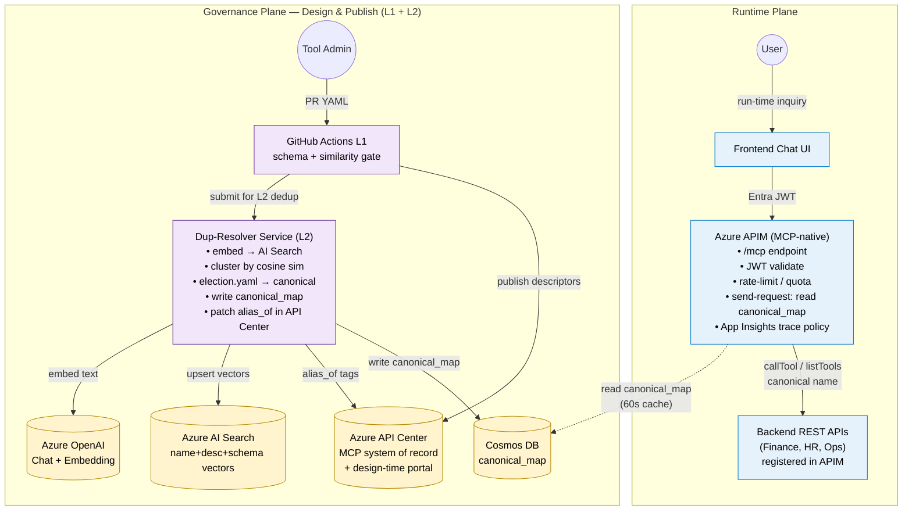

# MCP Governance Tool — V3 (APIM-MCP Native)

## Slide bullets

- **Background** — Teams publish duplicate MCP tools (`getQuote`, `get_stock_price`, `fetchTickerPrice`) under inconsistent names/schemas → fragmented agent catalog.
- **Problem** — No canonical identity, no design-time validation, no runtime enforcement → agents call wrong tool; shadow tools bypass policy.
- **Solution (V3)** — APIM **natively exposes a single `/mcp` endpoint** (Entra auth, throttle, trace). Governance Plane dedups via embeddings + election and writes a `canonical_map`; APIM's `send-request` policy enforces canonical routing on every `listTools` / `callTool`. API Center is the system of record **and** the developer-facing MCP discovery portal (design-time only).

---

## Mermaid diagram



---

## draw.io / diagrams.net XML

Save the block below as `v3_architecture.drawio` and open in [draw.io desktop](https://www.drawio.com/) or VS Code Draw.io extension.

```xml
<mxfile host="app.diagrams.net" modified="2026-05-07T00:00:00.000Z" agent="agent-framework" version="24.0.0">
  <diagram name="V3 MCP Governance" id="v3-mcp-gov">
    <mxGraphModel dx="1422" dy="754" grid="1" gridSize="10" guides="1" tooltips="1" connect="1" arrows="1" fold="1" page="1" pageScale="1" pageWidth="1600" pageHeight="900" math="0" shadow="0">
      <root>
        <mxCell id="0" />
        <mxCell id="1" parent="0" />

        <!-- ===== RUNTIME PLANE BOX ===== -->
        <mxCell id="rtPlane" value="Runtime Plane" style="rounded=0;whiteSpace=wrap;html=1;fillColor=none;strokeColor=#1F4E79;strokeWidth=2;fontSize=14;fontStyle=1;align=left;verticalAlign=top;spacingLeft=10;spacingTop=6;" vertex="1" parent="1">
          <mxGeometry x="40" y="40" width="1500" height="320" as="geometry" />
        </mxCell>

        <mxCell id="user" value="User" style="shape=umlActor;verticalLabelPosition=bottom;labelBackgroundColor=none;verticalAlign=top;html=1;outlineConnect=0;" vertex="1" parent="1">
          <mxGeometry x="90" y="160" width="40" height="80" as="geometry" />
        </mxCell>

        <mxCell id="ui" value="Frontend Chat UI" style="rounded=1;whiteSpace=wrap;html=1;fillColor=#DAE8FC;strokeColor=#6C8EBF;" vertex="1" parent="1">
          <mxGeometry x="200" y="170" width="160" height="60" as="geometry" />
        </mxCell>

        <mxCell id="apim" value="Azure APIM (MCP-native)&#10;&#10;• /mcp endpoint&#10;• Entra JWT validate&#10;• rate-limit / quota&#10;• send-request: canonical_map&#10;• App Insights trace policy" style="rounded=1;whiteSpace=wrap;html=1;fillColor=#E1D5E7;strokeColor=#9673A6;align=left;spacingLeft=10;" vertex="1" parent="1">
          <mxGeometry x="430" y="120" width="320" height="170" as="geometry" />
        </mxCell>

        <mxCell id="backends" value="Backend REST APIs&#10;(Finance, HR, Ops)&#10;registered in APIM" style="rounded=1;whiteSpace=wrap;html=1;fillColor=#D5E8D4;strokeColor=#82B366;" vertex="1" parent="1">
          <mxGeometry x="850" y="160" width="240" height="80" as="geometry" />
        </mxCell>

        <!-- runtime arrows -->
        <mxCell id="e1" style="endArrow=block;html=1;exitX=1;exitY=0.5;entryX=0;entryY=0.5;" edge="1" parent="1" source="user" target="ui">
          <mxGeometry relative="1" as="geometry" />
          <mxCell id="e1l" value="run-time inquiry" style="text;html=1;align=center;" vertex="1" connectable="0" parent="e1">
            <mxGeometry x="-0.2" y="-1" relative="1" as="geometry" />
          </mxCell>
        </mxCell>
        <mxCell id="e2" style="endArrow=block;html=1;" edge="1" parent="1" source="ui" target="apim">
          <mxGeometry relative="1" as="geometry">
            <Array as="points"><mxPoint x="395" y="200" /></Array>
          </mxGeometry>
          <mxCell id="e2l" value="Entra JWT" style="text;html=1;" vertex="1" connectable="0" parent="e2">
            <mxGeometry x="-0.2" y="-1" relative="1" as="geometry" />
          </mxCell>
        </mxCell>
        <mxCell id="e3" style="endArrow=block;html=1;" edge="1" parent="1" source="apim" target="backends">
          <mxGeometry relative="1" as="geometry" />
          <mxCell id="e3l" value="callTool / listTools (canonical)" style="text;html=1;" vertex="1" connectable="0" parent="e3">
            <mxGeometry x="-0.2" y="-1" relative="1" as="geometry" />
          </mxCell>
        </mxCell>

        <!-- ===== GOVERNANCE PLANE BOX ===== -->
        <mxCell id="govPlane" value="Governance Plane — Design &amp; Publish (L1 + L2)" style="rounded=0;whiteSpace=wrap;html=1;fillColor=none;strokeColor=#6B2FA5;strokeWidth=2;fontSize=14;fontStyle=1;align=left;verticalAlign=top;spacingLeft=10;spacingTop=6;" vertex="1" parent="1">
          <mxGeometry x="40" y="400" width="1500" height="460" as="geometry" />
        </mxCell>

        <mxCell id="admin" value="Tool Admin" style="shape=umlActor;verticalLabelPosition=bottom;labelBackgroundColor=none;verticalAlign=top;html=1;outlineConnect=0;" vertex="1" parent="1">
          <mxGeometry x="90" y="500" width="40" height="80" as="geometry" />
        </mxCell>

        <mxCell id="gha" value="GitHub Actions L1&#10;schema + similarity gate" style="rounded=1;whiteSpace=wrap;html=1;fillColor=#FFE6CC;strokeColor=#D79B00;" vertex="1" parent="1">
          <mxGeometry x="200" y="510" width="200" height="70" as="geometry" />
        </mxCell>

        <mxCell id="dup" value="Dup-Resolver Service (L2)&#10;&#10;• embed → AI Search&#10;• cluster by cosine sim&#10;• election.yaml → canonical&#10;• write canonical_map&#10;• patch alias_of in API Center" style="rounded=1;whiteSpace=wrap;html=1;fillColor=#F2E6FB;strokeColor=#6B2FA5;align=left;spacingLeft=10;" vertex="1" parent="1">
          <mxGeometry x="500" y="470" width="300" height="160" as="geometry" />
        </mxCell>

        <mxCell id="apic" value="Azure API Center&#10;MCP system of record&#10;+ design-time portal" style="shape=cylinder3;whiteSpace=wrap;html=1;boundedLbl=1;backgroundOutline=1;size=15;fillColor=#FFF2CC;strokeColor=#D6B656;" vertex="1" parent="1">
          <mxGeometry x="900" y="480" width="180" height="100" as="geometry" />
        </mxCell>

        <mxCell id="cosmos" value="Cosmos DB&#10;canonical_map" style="shape=cylinder3;whiteSpace=wrap;html=1;boundedLbl=1;backgroundOutline=1;size=15;fillColor=#FFF2CC;strokeColor=#D6B656;" vertex="1" parent="1">
          <mxGeometry x="1180" y="480" width="180" height="100" as="geometry" />
        </mxCell>

        <mxCell id="aisearch" value="Azure AI Search&#10;name+desc+schema&#10;vector index" style="shape=cylinder3;whiteSpace=wrap;html=1;boundedLbl=1;backgroundOutline=1;size=15;fillColor=#FFF2CC;strokeColor=#D6B656;" vertex="1" parent="1">
          <mxGeometry x="600" y="700" width="200" height="100" as="geometry" />
        </mxCell>

        <mxCell id="aoai" value="Azure OpenAI&#10;Chat + Embedding" style="shape=cylinder3;whiteSpace=wrap;html=1;boundedLbl=1;backgroundOutline=1;size=15;fillColor=#FFF2CC;strokeColor=#D6B656;" vertex="1" parent="1">
          <mxGeometry x="900" y="700" width="200" height="100" as="geometry" />
        </mxCell>

        <!-- governance arrows -->
        <mxCell id="g1" style="endArrow=block;html=1;" edge="1" parent="1" source="admin" target="gha">
          <mxGeometry relative="1" as="geometry" />
          <mxCell id="g1l" value="PR YAML" style="text;html=1;" vertex="1" connectable="0" parent="g1">
            <mxGeometry x="-0.2" y="-1" relative="1" as="geometry" />
          </mxCell>
        </mxCell>
        <mxCell id="g2" style="endArrow=block;html=1;" edge="1" parent="1" source="gha" target="dup">
          <mxGeometry relative="1" as="geometry" />
          <mxCell id="g2l" value="submit for L2 dedup" style="text;html=1;" vertex="1" connectable="0" parent="g2">
            <mxGeometry x="-0.2" y="-1" relative="1" as="geometry" />
          </mxCell>
        </mxCell>
        <mxCell id="g3" style="endArrow=block;html=1;exitX=0.5;exitY=0;entryX=0.5;entryY=1;" edge="1" parent="1" source="gha" target="apic">
          <mxGeometry relative="1" as="geometry">
            <Array as="points"><mxPoint x="300" y="450" /><mxPoint x="990" y="450" /></Array>
          </mxGeometry>
          <mxCell id="g3l" value="publish descriptors" style="text;html=1;" vertex="1" connectable="0" parent="g3">
            <mxGeometry x="-0.2" y="-1" relative="1" as="geometry" />
          </mxCell>
        </mxCell>
        <mxCell id="g4" style="endArrow=block;html=1;" edge="1" parent="1" source="dup" target="apic">
          <mxGeometry relative="1" as="geometry" />
          <mxCell id="g4l" value="alias_of tags" style="text;html=1;" vertex="1" connectable="0" parent="g4">
            <mxGeometry x="-0.2" y="-1" relative="1" as="geometry" />
          </mxCell>
        </mxCell>
        <mxCell id="g5" style="endArrow=block;html=1;" edge="1" parent="1" source="dup" target="cosmos">
          <mxGeometry relative="1" as="geometry" />
          <mxCell id="g5l" value="write canonical_map" style="text;html=1;" vertex="1" connectable="0" parent="g5">
            <mxGeometry x="-0.2" y="-1" relative="1" as="geometry" />
          </mxCell>
        </mxCell>
        <mxCell id="g6" style="endArrow=block;html=1;" edge="1" parent="1" source="dup" target="aisearch">
          <mxGeometry relative="1" as="geometry" />
          <mxCell id="g6l" value="upsert vectors" style="text;html=1;" vertex="1" connectable="0" parent="g6">
            <mxGeometry x="-0.2" y="-1" relative="1" as="geometry" />
          </mxCell>
        </mxCell>
        <mxCell id="g7" style="endArrow=block;html=1;" edge="1" parent="1" source="dup" target="aoai">
          <mxGeometry relative="1" as="geometry" />
          <mxCell id="g7l" value="embed text" style="text;html=1;" vertex="1" connectable="0" parent="g7">
            <mxGeometry x="-0.2" y="-1" relative="1" as="geometry" />
          </mxCell>
        </mxCell>

        <!-- cross-plane: APIM reads canonical_map -->
        <mxCell id="cp1" style="endArrow=block;html=1;dashed=1;exitX=1;exitY=0.5;entryX=0.5;entryY=0;" edge="1" parent="1" source="apim" target="cosmos">
          <mxGeometry relative="1" as="geometry">
            <Array as="points"><mxPoint x="1270" y="205" /></Array>
          </mxGeometry>
          <mxCell id="cp1l" value="read canonical_map (60s cache)" style="text;html=1;" vertex="1" connectable="0" parent="cp1">
            <mxGeometry x="-0.2" y="-1" relative="1" as="geometry" />
          </mxCell>
        </mxCell>

      </root>
    </mxGraphModel>
  </diagram>
</mxfile>
```

---

## What changed vs V2

| # | V2 | V3 |
|---|---|---|
| 1 | Two custom MCP servers behind APIM | Removed — APIM exposes `/mcp` natively; backends are plain REST in APIM |
| 2 | Auth handled at MCP server | Entra JWT validated at APIM before any tool runs |
| 3 | API Center = system of record only | API Center = system of record **+** design-time discovery portal |
| 4 | Telemetry split across servers | Single APIM trace policy → App Insights for every tool call |
| 5 | Governance plane (dedup + election) | Unchanged — this remains the differentiator |

## Caveat (footnote)

> APIM-MCP currently supports MCP **tools** only — not **resources** or **prompts**. If those become in-scope, add a thin custom MCP shim for those types only.
