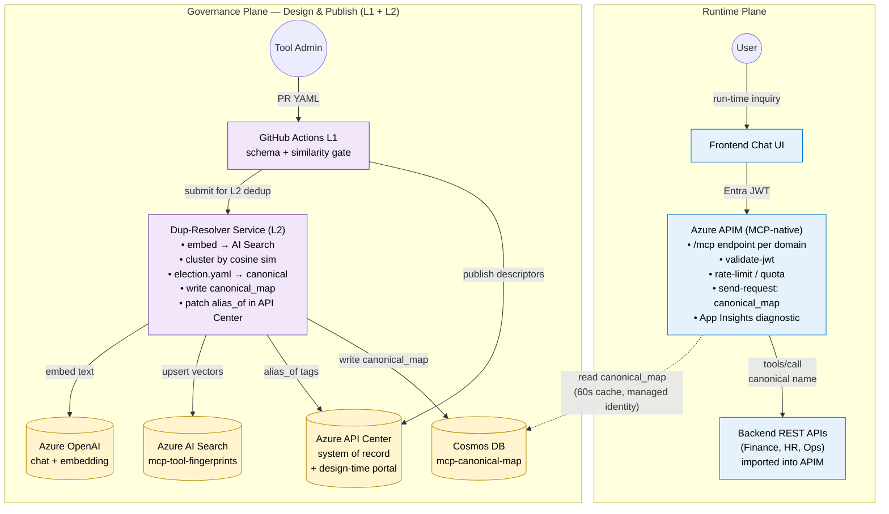

# MCP Tool Governance — POC Detailed Plan (v3)

**Status:** Draft v3 — APIM-MCP native
**Owner:** Peter Lee
**Supersedes:** [v2](./MCP-Tool-Governance-POC-Plan-v2.md) — two custom MCP server Container Apps fronted by APIM
**Timeframe:** 3 weeks (1 engineer + 0.25 SRE, part-time stakeholders)
**Goal:** Prove that a **three-layer governance model** (CI gate → API Center + Dup-Resolver → APIM run-time enforcement) eliminates MCP tool collisions, semantic duplicates, overloads, and ungoverned tool grouping — with **APIM acting as the MCP server natively** (no custom MCP server containers), and a chat frontend driving the demo end-to-end.

> This document is a **standalone replacement** for v2, not a diff. The structure, section numbering, and depth match v2 deliberately so the two can be compared side-by-side. Where content is identical to v2 it is repeated verbatim; where V3 changes the design it is fully restated here.

---

## What changed since v2

| v2 | v3 |
|---|---|
| Two custom MCP server Container Apps (A, B) hand-rolled with the `mcp` SDK | **Removed** — APIM exposes a native `/mcp` endpoint per imported REST API; tools are auto-derived from OpenAPI |
| Auth handled inside the MCP servers | **Entra JWT validated at APIM** before any tool dispatch |
| Aggregator API in APIM did `listTools` fan-out + canonical rewrite | Each domain (Finance, HR, Ops) is its own APIM-MCP server; rewrite happens in the **MCP-server-scoped policy** via `send-request` to Cosmos |
| API Center = system of record + cluster metadata | API Center = system of record **+ design-time discovery portal** (humans browse it; agents do not) |
| Telemetry split across two custom servers | **Single APIM diagnostic setting → App Insights** for every `tools/list` and `tools/call` |
| Cosmos read by APIM via key | **Cosmos read by APIM via managed identity** + `authentication-managed-identity` policy |
| Fake Finance API as deterministic mock | Replaced by whichever real (or stand-in) REST API is already imported into APIM |
| Governance Plane (L1 + L2 + Dup-Resolver + election + governance allow-list) | **Unchanged** — this is the differentiator and travels forward as-is |

> **Caveat:** APIM-MCP currently supports MCP **tools** only — not **resources** or **prompts**. If those become in-scope, add a thin custom MCP shim for those types only. See [v3_architecture.md](./v3_architecture.md) for the V3 diagrams (Mermaid + draw.io).

---

## Table of Contents

- [What changed since v2](#what-changed-since-v2)
- [1. Background \& Problem Statement](#1-background--problem-statement)
- [2. POC Objectives \& Success Criteria](#2-poc-objectives--success-criteria)
- [3. Scope (In / Out)](#3-scope-in--out)
  - [3.1 Feasible PoC Scope — the smart path to "workable"](#31-feasible-poc-scope--the-smart-path-to-workable)
  - [3.2 Authored name vs. wire name (APIM-MCP naming model)](#32-authored-name-vs-wire-name-apim-mcp-naming-model)
  - [3.3 Why both L1 lint and L3 runtime rewrite — they solve different problems](#33-why-both-l1-lint-and-l3-runtime-rewrite--they-solve-different-problems)
- [4. High-Level Architecture](#4-high-level-architecture)
  - [4.1 Topology options & upgrade path](#41-topology-options--upgrade-path)
- [5. Three-Layer Governance Model](#5-three-layer-governance-model)
- [6. Components — Responsibilities \& Key Features](#6-components--responsibilities--key-features)
- [7. Reused vs New Azure Resources](#7-reused-vs-new-azure-resources)
- [8. Infrastructure as Code (Terraform)](#8-infrastructure-as-code-terraform)
- [9. Naming Standard](#9-naming-standard)
- [10. Tool Registry Schema](#10-tool-registry-schema)
- [11. Two Exposure Surfaces (governed vs messy MCP servers)](#11-two-exposure-surfaces-governed-vs-messy-mcp-servers)
- [12. Curated Agent Profiles](#12-curated-agent-profiles)
- [13. Layer 1 — Design-Time Gate (`tools-cli` + CI)](#13-layer-1--design-time-gate-tools-cli--ci)
- [14. Layer 2 — API Center + Dup-Resolver Service](#14-layer-2--api-center--dup-resolver-service)
- [15. Layer 3 — APIM Run-Time Enforcement (APIM-MCP native)](#15-layer-3--apim-run-time-enforcement-apim-mcp-native)
- [16. Frontend (Chat UI)](#16-frontend-chat-ui)
- [17. Three-Week Plan (Day-by-Day)](#17-three-week-plan-day-by-day)
- [18. Deliverables \& Artifacts](#18-deliverables--artifacts)
- [19. Before/After Evaluation](#19-beforeafter-evaluation)
- [20. Risks \& Mitigations](#20-risks--mitigations)
- [21. Cost Estimate](#21-cost-estimate)
- [22. Roles \& Responsibilities](#22-roles--responsibilities)
- [23. Demo Script (45 minutes)](#23-demo-script-45-minutes)
- [24. Post-POC Recommendations](#24-post-poc-recommendations)
- [A. Azure Services That Could Strengthen This PoC](#a-azure-services-that-could-strengthen-this-poc)
- [25. Glossary](#25-glossary)
- [26. References](#26-references)

---

## 1. Background & Problem Statement

(Identical to v2 — the problem hasn't changed; the implementation has.)

As more APIs are exposed through APIM and surfaced as MCP tools, **five** problems compound quickly:

1. **Name collisions** — `createCustomer`, `CreateCustomer`, `customer_create`, `CustomerAPI_Final_v3` all do the same thing. Agents pick one and execute silently.
2. **Semantic duplicates** — `customer.find`, `customer.search`, `customer.lookup` look different but overlap behaviorally.
3. **Tool overloading** — three versions of `invoice_create` with different schemas under the same name.
4. **Ungrouped tools** — flat names like `lookup`, `create`, `list` with no domain prefix; agents can't disambiguate.
5. **Gateway naming drift** — APIM-MCP **rewrites** the OpenAPI operation summary into a wire tool name using its own normalization rules (split on non-identifier chars, lowercase first token, TitleCase the rest). So an authored summary `finance_quote_get` is exposed to the LLM as `financeQuoteGet`. The name the developer wrote, the name the LLM sees, and the name a governance policy must match against are three different strings unless you account for it. Discovered empirically on `apimopenai99` — see [lessons.md](lessons.md) and §3 below.

**What V3 changes:** in v2 each backend team published an MCP server. In V3 the moment any team imports a REST API into APIM, that API can be **flipped on as an MCP server with a single click** — the catalog grows even faster, and the governance problem is even more urgent.

The customer's analogy: this is the **Facebook-username problem**. The platform must establish identity, naming, and verification rules **before** the catalog scales. Once we federate to **Amazon Bedrock** ([APIM-AWSBedrockChain.md](../apim/APIM-AWSBedrockChain.md)) and **Google Vertex AI**, the mess multiplies across three clouds.

> Reference: [Microsoft Research — Tool Space Interference in the MCP Era](https://www.microsoft.com/en-us/research/blog/tool-space-interference-in-the-mcp-era-designing-for-agent-compatibility-at-scale/)

---

## 2. POC Objectives & Success Criteria

### Objectives

| # | Objective |
|---|---|
| O1 | Prove the **three-layer governance model** (L1 CI → L2 catalog → L3 gateway) end-to-end with **APIM-MCP native** at L3 |
| O2 | Demonstrate **cross-MCP-server** duplicate detection (a tool exposed by the messy APIM-MCP server duplicates one in the governed APIM-MCP server → resolver clusters them) |
| O3 | Demonstrate run-time **canonical rewrite** in an **MCP-server-scoped APIM policy** that calls Cosmos via managed identity |
| O4 | Drive demos from a **frontend** so non-engineers can flip profile and MCP-server toggles and *see* the difference |
| O5 | Run a **before/after evaluation** with measurable reduction in wrong-tool selection |
| O6 | Produce a **decision-ready recommendation** + Terraform stack + Portal-pasteable APIM policy reusable for production hardening |

### Success criteria

- L1 blocks a duplicate PR with a readable error in < 60 s.
- L2 clusters two cross-server duplicates and elects a canonical without human input.
- L3 (the MCP-server policy) returns a **single canonical tool** to the agent even when both APIM-MCP servers advertise it.
- Frontend toggles produce visibly different `tools/list` payloads and outcomes.
- Eval shows ≥ 25-point absolute lift in correct-tool rate (governed vs ungoverned).
- One Cosmos doc, one APIM cache key, one App Insights span per `tools/call` — no fan-out, no aggregator service.

---

## 3. Scope (In / Out)

### In
- **Two APIM-MCP servers** on the existing `<apim-instance>` instance (or equivalent), both backed by REST APIs already in APIM.
- Single Azure region (East US, to colocate with the APIM instance).
- One domain (`finance` — invoice + customer) for the demo narrative.
- 5–8 governed tools + 4 collision tools + 3 semantic-dup tools + 3 overloads + 3 ungrouped tools, sourced from existing API operations or seeded via a thin demo REST API.
- Chat frontend with profile + MCP-server toggles.
- Terraform stack covering the new sub-resources; `data` blocks for reused resources. APIM policy XML pasteable from the Portal.

### Out
- AWS Bedrock / Vertex AI federation (covered separately; introduce after standard is in place).
- MCP **resources** and **prompts** (APIM-MCP doesn't surface those yet — see Caveat).
- Multi-region / DR.
- Production observability (SLOs, paging, runbooks).
- Real customer data; real production APIs.
- Full RBAC matrix beyond Entra workload identity per Container App.

### 3.1 Feasible PoC Scope — the smart path to "workable"

The full plan is intentionally broader than what's needed to *prove the idea*. To stay inside the 3-week budget and still produce evidence the customer can act on, work is organized into three concentric rings. **Ring 1 is the must-ship.** Rings 2 and 3 are stretch.

| Ring | Goal | Features | Why this is enough |
|---|---|---|---|
| **Ring 1 — Core proof (must-ship)** | Show that the three-layer model works end-to-end on a real Azure footprint with **APIM-MCP native**. | • Two APIM-MCP servers (`governed/mcp`, `messy/mcp`) on the existing APIM instance, each derived from an imported REST API.<br>• MCP-server-scoped policy doing JWT validate, rate-limit, canonical_map `send-request` to Cosmos via managed identity, and `set-body` rewrite of `params.name`.<br>• Dup-Resolver service implementing **clustering + canonical election** (§14.1 + §14.2) with the deterministic weighted-score algorithm.<br>• Cosmos `mcp-canonical-map` container + AI Search `mcp-tool-fingerprints` index, written **only** by the resolver.<br>• Frontend with profile + MCP-server toggles + side-by-side raw-vs-governed `tools/list` panel.<br>• L1 CI gate that calls `/similarity` and blocks duplicate PRs.<br>• Eval harness (§19) for 20 prompts × 3 configs × 3 runs. | Demonstrates **all four failure modes are caught** and that an LLM picks the right tool reliably — without any custom MCP server code to maintain. |
| **Ring 2 — Governance lifecycle (recommended)** | Show the system is **operable**, not just buildable. | • `registry/governance/backends.yaml` + `election.yaml` (§14.3) with CODEOWNERS + 2-of-2 approval.<br>• `tools-cli governance validate` + `governance impact` (election simulator that posts a PR comment).<br>• Re-attestation cron that opens an issue 30 days before `review_due`.<br>• API Center entries patched with `canonical_id` + `aliases[]` + `cluster_id`. | Answers the "how do we maintain this?" question that any executive will ask. Without it, the demo looks like a science project. |
| **Ring 3 — Polish (only if Ring 1+2 finish early)** | Demo gloss + production hardening pointers. | • Approval-gated mutations via APIM Products + Entra App Roles.<br>• MCP Interviewer report comparing the two APIM-MCP servers.<br>• Workbook tile: governance freshness + canonical-change feed + canonical-rewrite hit rate.<br>• Cost dashboard tile.<br>• Recorded narrated demo (vs live). | Nice to have; not load-bearing for the decision. |

**Smart trade-offs we're explicitly making:**

- **Two APIM-MCP servers, not five.** Two is the minimum to demonstrate *cross-server* canonicalization, and avoids combinatorial explosion in the eval matrix.
- **One domain (`finance`), not many.** Domain breadth doesn't validate the algorithm; it just adds tools. Depth (4 failure modes well-seeded) > breadth.
- **Deterministic scoring, not LLM-judged elections.** All weights are explainable and replayable from `(governance_ref, election_ref)` SHAs. LLM-as-judge stays as an *optional tiebreaker* in the warn band only.
- **Single-linkage clustering at threshold 0.88.** Over-clusters slightly on purpose; humans can split via `pinned_canonical`. Under-clustering would let dups leak through, which defeats the PoC.
- **Reuse APIM/Search/Cosmos/AOAI; new only what doesn't exist.** Marginal cost stays under $80 (lower than v2 because no Container App MCP servers).
- **Cosmos cache TTL = 60 s, not realtime.** Acceptable for a PoC; §A lists the production upgrade path (Change Feed → Event Grid → cache flush).
- **APIM cache, not Redis.** Built into APIM; one less service to provision. Upgrade path is in §A.
- **Local terraform state for dev.** Skips the storage-account + lock setup; `envs/dev.backend.hcl.example` shows the production path.

**Definition of "workable" (exit criteria):**

1. Eval Config B (governed) hits **≥ 95 % correct-tool rate** on the 20-prompt set, vs Config A (≤ 70 %).
2. A PR adding a duplicate to `governed/` is **blocked by L1 CI** with the resolver's similarity score in the PR comment.
3. The governed APIM-MCP server returns **one** `convert_currency` (or equivalent) when both servers ship near-duplicates of it.
4. `tools-cli governance impact` shows the **election delta** for any change to `backends.yaml` before merge.
5. A canonical record in Cosmos contains `governance_ref` + `election_ref` SHAs proving any election is **replayable**.
6. The APIM policy reads Cosmos via **managed identity** — no Cosmos keys appear in policy or Key Vault.

If those six hold, the PoC has cleared the bar. Anything else is gravy.

### 3.2 Authored name vs. wire name (APIM-MCP naming model)

A subtle but operationally critical fact discovered during PoC build-out: when APIM exposes a REST API as an MCP server, the **MCP tool name the LLM sees is not the OpenAPI `operationId` and not the URL path** — it is the OpenAPI **operation `summary`**, normalized through APIM's own naming rules.

The normalization (verified against `apimopenai99/governed-mcp` 2026-05-08, fingerprint matches .NET `JsonNamingPolicy.CamelCase`):

1. Split the summary on any non-identifier character (`_`, `-`, space, `.`).
2. Lowercase the **first** token.
3. TitleCase every subsequent token.
4. Concatenate.

| Authored OpenAPI `summary` | APIM-MCP wire tool name |
|---|---|
| `finance_quote_get` | `financeQuoteGet` |
| `finance_customer_search` | `financeCustomerSearch` |
| `Get Finance Invoice` | `getFinanceInvoice` |
| `payment.approve` | `paymentApprove` |

**Why this matters for governance:**
- The **canonical_id in Cosmos must equal the wire name** (or be reachable through an alias whose `id` equals the wire name) — otherwise the L3 policy's `send-request` to `/dbs/.../docs/{requestedTool}` will 404 and the policy will fail-open through to whatever the LLM sent.
- The **L1 lint rule** (§9 / §13) must enforce naming standards on the *summary*, not just the operationId, because the summary is the load-bearing string at runtime.
- **Two operations with different paths but the same summary collide** at the MCP wire layer. APIM-MCP picks one and silently drops the other. (Observed on `messy-mcp`: 13 declared ops → 12 surfaced.) This is failure mode #5 (gateway naming drift) from §1.

**The three names to keep straight:**

| Name | Where it lives | Example | Used by |
|---|---|---|---|
| **Authored name** | OpenAPI `summary` field | `finance_quote_get` | Developer, L1 lint, design review |
| **Wire name** | What APIM-MCP advertises in `tools/list` | `financeQuoteGet` | LLM, L3 policy `params.name`, Cosmos doc id |
| **Canonical id** | Cosmos `mcp-canonical-map` doc | `financeQuoteGet` (same as wire, by convention) | L3 rewrite target, eval harness, L2 election record |

The PoC convention is: **canonical_id ≡ wire name**. Aliases are stored as additional Cosmos docs whose `id` equals the alias and whose `primary.name` points back to the wire name. See [`tools-cli/seed_canonical_map.py`](../tools-cli/seed_canonical_map.py) for the seeding pattern and [`apim/policies/canonical-rewrite-smoke.policy.xml`](../apim/policies/canonical-rewrite-smoke.policy.xml) for the consuming policy.

### 3.3 Why both L1 lint and L3 runtime rewrite — they solve different problems

A reasonable question after seeing the canonical-rewrite policy in action: *"If APIM-MCP exposes the wire name we control, and the LLM picks straight from `tools/list`, why is the L3 rewrite layer needed at all? Wouldn't L1 alone be sufficient?"*

In a **single-tenant, single-team, never-federated** PoC: yes, L1 alone is enough. APIM exposes only compliant names, the LLM only ever sees compliant names, the rewrite policy fires `none` 100% of the time and is dead weight.

In the **real customer scenario** (multi-team APIM, planned federation to Bedrock and Vertex per §1, normal product evolution over years), the rewrite layer earns its keep four ways. L1 cannot solve any of them:

| Scenario | What happens | Why L1 can't fix it | What L3 does |
|---|---|---|---|
| **Multi-server federation** | CRM team's `crm-mcp` exposes `getCustomer`; Finance team's `governed-mcp` exposes `financeCustomerGet`. Agent connects to both, picks the shorter name. | Each team owns their own repo. L1 in finance/repo cannot dictate names in crm/repo. | Reconciles cross-server aliases at the gateway. |
| **External / legacy callers** | A partner's agent (or a Bedrock-hosted agent built before your standard existed) sends `get_quote`. | You don't control their code; you can't make them redeploy. | Absorbs the legacy name without breaking the partner. |
| **Renaming a canonical** | `financeQuoteGet` should become `financeMarketQuoteGet` because you're adding `financeInternalQuoteGet`. | L1 enforces today's standard; it cannot retroactively migrate every deployed agent. | Add `financeQuoteGet` as an alias pointing at `financeMarketQuoteGet`. Old agents keep working; new agents see the new name. **HTTP-301-redirect for tools.** |
| **LLM hallucination on known patterns** | Agent emits `getStockPrice` (vocabulary from a different finance ontology) for what should be `financeQuoteGet`. | L1 only checks specs at PR time; it never sees runtime tool calls. | Map known-frequent hallucinations to canonicals after observing them in eval/prod logs. |

**Two distinct jobs, two distinct enforcement points:**

| Job | Enforcement point | Implementation |
|---|---|---|
| **Authoring discipline** — never let bad names *enter* the catalog | At PR time | L1 lint (`tools-cli/lint.py`, GitHub Actions) |
| **Federation and evolution** — reconcile names *across catalogs and across time* | At call time | L3 rewrite policy (Cosmos + APIM `send-request`) |

**L1 keeps your catalog clean. L3 lets you change the catalog without breaking the world, and lets you accept calls from systems you don't control.** Either layer alone is fragile at scale; both together are robust.

A third option exists in the MCP spec — embed aliases as prose hints inside tool descriptions ("also known as `getCustomer`, `customer.lookup`...") and trust the LLM to map them. We rejected this because it depends on the LLM reading and respecting prose at inference time (non-deterministic) and provides no audit trail. The Cosmos+policy path is enforceable, replayable, and produces an `x-mcp-canonical-rewrite` response header that App Insights can index. **For governance-critical paths (financial transactions, PII access), enforceable beats hopeful.**

---

## 4. High-Level Architecture

> **Data-flow rule:** the Dup-Resolver is the only component that talks to AI Search and the only component that *writes* to the Cosmos `mcp-canonical-map` container. APIM only *reads* the canonical_map from Cosmos at runtime via managed identity. AI Search and Cosmos do not talk to each other directly.



A draw.io / diagrams.net version of the same diagram lives in [v3_architecture.md](./v3_architecture.md) for slide use.

### Reading the diagram — what each runtime box actually does

In V3 there is **no custom MCP server tier**. APIM is the MCP server. Each box on the runtime swim-lane:

| Box | Role | What's inside | What it is **not** |
|---|---|---|---|
| **Frontend Chat UI** | MCP client | Next.js Container App; signs the user in via Entra; opens an MCP session against an APIM `/mcp` URL (e.g. `https://<apim-gateway-host>/coi-mcp/mcp`). Renders profile + MCP-server toggles. | Not a tool registry; does not talk to API Center at runtime. |
| **Azure APIM (MCP-native)** | The MCP server | One **MCP-server entity per domain** in APIM (visible in the Portal under *APIs → MCP Servers*). Each one auto-derives `tools/list` from the imported REST API's OpenAPI. The MCP-server-scoped policy does JWT validation, rate-limit, the canonical_map `send-request` to Cosmos via managed identity, alias rewrite, and App Insights tracing. | Not custom code. No container to host or patch. |
| **Backend REST APIs** | The actual business backends | FastAPI / ASP.NET / etc. services already imported into APIM (Finance, HR, Ops). Idempotent HTTP endpoints. Deterministic. | Not MCP servers. The agent never speaks MCP to them — APIM translates MCP `tools/call` into the matching backend HTTP call. |

**Why the duplicate-tool problem still exists.** Different teams independently expose overlapping capabilities as REST operations (e.g. `GET /quotes/{ticker}`, `GET /stocks/{symbol}/price`, `POST /fx/convert` and `GET /currency/convert`). Each one becomes an MCP tool the moment it's surfaced through APIM-MCP. Without governance, the agent sees three near-identical tools and picks one at random.

**A request walk-through (V3) — first call, cold cache (MISS path):**

```
Agent → POST https://<apim-gateway-host>/finance/mcp
         { jsonrpc: "2.0",
           id: 1,
           method: "tools/call",
           params: { name: "fxConvert", arguments: {...} } }
         │
         │  APIM <inbound> (MCP-server-scoped policy):
         │    1. validate-jwt (Entra JWT, audience api://mcp-gateway)
         │    2. rate-limit-by-key
         │    3. cache-lookup-value key="canon:fxConvert"  →  variable NOT set (MISS)
         │    3a. <when> miss branch executes:
         │         - authentication-managed-identity (mint AAD token for Cosmos)
         │         - send-request GET cosmos-ws/.../docs/fxConvert
         │             → returns { id: "fxConvert", primary: { name: "convert_currency", ... } }
         │         - set-variable canonicalTool = "convert_currency"
         │         - cache-store-value key="canon:fxConvert" value="convert_currency" duration=60
         │    4. canonicalTool ("convert_currency") != requestedTool ("fxConvert") → rewrite:
         │         - set-body  params.name = "convert_currency"
         │         - set-header x-mcp-canonical-rewrite: fxConvert -> convert_currency
         ▼
       APIM dispatches to the matching backend operation
         │
         ▼
       Finance REST API  GET /fx?from=USD&to=EUR
         │
         ▼  { rate: 0.9142 }
       APIM <outbound>: diagnostic to App Insights (one span per call)
         │
         ▼
       Agent receives MCP tool-result envelope
```

**Second call within 60 seconds — warm cache (HIT path):**

```
Agent → POST .../finance/mcp   { ..., params: { name: "fxConvert", ... } }
         │
         │  APIM <inbound> (MCP-server-scoped policy):
         │    1. validate-jwt
         │    2. rate-limit-by-key
         │    3. cache-lookup-value key="canon:fxConvert"  →  canonicalTool = "convert_currency"  (HIT)
         │    3a. <when !ContainsKey(canonicalTool)> condition is FALSE → miss branch SKIPPED
         │         (no AAD token mint, no send-request to Cosmos, ~0 ms added)
         │    4. canonicalTool != requestedTool → rewrite (same as cold path):
         │         - set-body  params.name = "convert_currency"
         │         - set-header x-mcp-canonical-rewrite: fxConvert -> convert_currency
         ▼
       APIM dispatches → Finance REST API → response → outbound trace → agent
```

The hit path is the steady-state cost of governance: a single in-process `cache-lookup-value` and a JSON `set-body`. The Cosmos round-trip happens at most once per 60 s per distinct alias name per APIM gateway node. After 60 s the entry expires and the next call repeats the MISS path.

> **Already-canonical names** (e.g. an agent calls `convert_currency` directly): the Cosmos doc returned in step 3a has `primary.name == requestedTool`, so step 4's rewrite condition is FALSE — the body is unchanged and no `x-mcp-canonical-rewrite` header is stamped. From the backend's perspective the request is a plain pass-through.

**In production this generalizes cleanly:** the Backend REST APIs are whatever real APIM-fronted systems the capabilities live in (a payment gateway, a CRM, a pricing service). APIM-MCP is the **adapter layer** — and because it's declarative policy, different teams can independently expose overlapping capabilities without Platform writing a single line of integration code. The PoC's two-APIM-MCP-server setup is the smallest possible reproduction of that real-world failure mode.

**Cross-cutting (NEW unless noted):**
- Entra ID — user SSO + workload identities for any new Container Apps; **APIM system-assigned managed identity** for Cosmos
- Container Apps Environment + ACR (now hosts only Frontend + Dup-Resolver — not MCP servers)
- Log Analytics + Application Insights (one workspace, end-to-end traces with `x-mcp-canonical-rewrite` correlation)
- Key Vault — APIM keys, AOAI keys, frontend secrets (no Cosmos key needed)

### What APIM does in this PoC (v3 vs v2)

| Concern | v2 | v3 |
|---|---|---|
| MCP protocol termination | Inside custom MCP server containers | **APIM `/mcp` endpoint** (Streamable HTTP), one per domain |
| `tools/list` source | Hand-coded in MCP server | **Auto-derived from OpenAPI** by APIM-MCP |
| `tools/call` dispatch | Custom MCP server → HTTP backend | **APIM** maps MCP tool name → backend operation directly |
| Auth (client → APIM) | Entra JWT + sub key | **Entra JWT validated at APIM** before any tool runs |
| Backend auth | MI → Container App MCP server | MI → backend REST API (no MCP hop) |
| Rate limiting | 60/min/sub at APIM | 60/min/sub + per-tool quota |
| Canonical rewrite | Aggregator API in APIM fanned out to A + B and rewrote | **MCP-server-scoped policy**: `send-request` to Cosmos canonical_map (60s cache) + `set-body` to rewrite `params.name` |
| Cosmos auth | Account key from Key Vault | **Managed identity** via `authentication-managed-identity` |
| Logging | App Insights metadata + custom headers in MCP server | **One APIM diagnostic setting** → App Insights span per `tools/list` / `tools/call`, `x-mcp-canonical-rewrite` header on alias hits |

### 4.1 Topology options & upgrade path

V3 commits to **one MCP server entity per business domain** for the PoC. That is option **B** below. It is *not* the only viable topology, and the same V3 governance plane (canonical_map in Cosmos, Dup-Resolver, API Center, §15 policy) supports several others without redesign. This section enumerates the option space so the customer can see the full ladder, and locks in a staged adoption path.

#### Option space

| # | Option | What it is | Topology | Naming |
|---|---|---|---|---|
| **A** | **Flat — one MCP server for everything** | All operations from all domains imported into a single API; one `/mcp` endpoint | 1 MCP server | Domain prefix in tool name only (`finance_invoice_lookup`) |
| **B (V3 PoC)** | **One MCP server per domain** | Each domain (`finance`, `hr`, `ops`) is its own imported API → its own MCP server | N MCP servers (1 per domain) | URL path *is* the namespace |
| **C** | **One MCP server per backend system** | Each backend microservice gets its own MCP server | M MCP servers (1 per backend) | Domain prefix in tool name; URL = backend |
| **D** | **Two-tier: governed + raw, per domain** | Per-domain `<domain>/mcp` (curated, rewrite ON) + per-domain `<domain>-raw/mcp` (every operation, internal-Product only). Both backed by the same imported APIs. | 2N MCP servers | Two surfaces, same canonicals |
| **E** | **Profile-shaped MCP servers** (Products-driven) | One MCP server per *consumer profile* (`finance-analyst/mcp`, `support-agent/mcp`), composed at deploy time from canonicals across domains | P MCP servers (1 per profile) | Profile-bound, allow-list at exposure time |
| **F** | **Federated: APIM-MCP + custom shim** | Per-domain APIM MCP servers + a thin meta-MCP custom shim that aggregates `tools/list` and proxies `tools/call` (only worth it if MCP resources/prompts become must-have and APIM-MCP still doesn't support them) | N MCP servers + 1 shim | Single entry point for agents |
| **G** | **Multi-APIM (per BU / region)** | Separate APIM instances per business unit or geographic region; central governance plane reads from all | Multiple APIM instances, each with N MCP servers | `bu.domain.entity.action` |

#### Side-by-side evaluation

| Criterion | A. Flat | B. Per-domain (V3) | C. Per-backend | D. Two-tier | E. Per-profile | F. Federated | G. Multi-APIM |
|---|---|---|---|---|---|---|---|
| Blast radius of a bad tool | 🔴 entire catalog | 🟡 one domain | 🟢 one backend | 🟢 raw side only | 🟢 one profile | 🟡 one domain | 🟢 one BU |
| Tool-list size to agent | 🔴 huge → context bloat | 🟢 small (curated) | 🟡 medium | 🟢 small (curated) | 🟢 minimal | 🔴 huge if not filtered | 🟢 small |
| Policy differentiation per domain | 🔴 all-or-nothing | 🟢 native | 🟢 native | 🟢 native | 🟢 native | 🟢 native | 🟢 native |
| Cross-domain canonicalization | 🟢 single map | 🟢 cross-MCP via Cosmos | 🟡 cross-MCP via Cosmos | 🟢 explicit governed-side | 🟡 dedup at compose time | 🟢 shim does it | 🟡 cross-APIM is harder |
| Team autonomy / self-service | 🔴 platform bottleneck | 🟢 each domain owns its API | 🟢 each backend team owns | 🟢 raw surface ships day-1 | 🔴 platform owns profiles | 🟡 mixed | 🟢 BU-level |
| Operational sprawl | 🟢 1 thing | 🟢 ~3–10 | 🟡 10–50 | 🟡 2× domain count | 🔴 grows with consumers | 🟡 N+1 | 🔴 multi-instance |
| Onboarding new consumer | 🟢 connect to /mcp | 🟢 connect to relevant /mcp | 🟡 must know backends | 🟢 connect to governed/mcp | 🟢 connect to your profile/mcp | 🟢 single endpoint | 🟡 must know BU |
| Cost (APIM ops + storage) | 🟢 minimal | 🟢 minimal | 🟡 minimal | 🟡 doubles MCP entities | 🟢 minimal | 🟡 +shim Container App | 🔴 multi-instance licensing |
| Fits APIM-MCP "no per-tool policy" | 🔴 must branch in policy | 🟢 yes | 🟢 yes | 🟢 yes | 🟢 yes | 🟢 yes | 🟢 yes |
| Fits APIM-MCP "no Workspaces" | 🟢 N/A | 🟢 N/A (use Products for RBAC) | 🟢 N/A | 🟢 N/A | 🟢 N/A — Products *are* the unit | 🟢 N/A | 🟢 partition at instance level |
| Resilience to APIM-MCP gaps (resources/prompts) | 🔴 same gap, magnified | 🟡 same gap | 🟡 same gap | 🟡 same gap | 🟡 same gap | 🟢 shim can add | 🟡 same gap |
| Demo-ability for the PoC | 🔴 hides dup-tool problem | 🟢 cleanest narrative | 🟡 noisy | 🟢 strongest narrative | 🟡 needs many profiles | 🔴 too much plumbing | 🔴 too big for 3-week PoC |
| Governance plane unchanged | 🟢 | 🟢 | 🟢 | 🟢 | 🟢 | 🟢 | 🟡 needs aggregation |

#### Recommended staged upgrade path

```
   PoC               Pilot (90d)         Year 1            Year 2+ (only if forced)
   ───               ───────────         ──────            ────────────────────────
   B                 D                   D + E             D + E + G
   per-domain        + raw tier          + per-profile     + multi-APIM
   (governed/messy   per domain          MCP servers       per BU/region
    for demo)
```

**PoC (Ring 1 — already in this plan):** Option **B**, with the §6.3 "governed vs messy" toggle as a 1-domain slice of Option D for demo purposes only. The `messy/mcp` server is a **demo prop** that exists to make the four failure modes visible; it gets dropped after the demo.

**Pilot — first 90 days post-PoC: full Option D, scoped to 2–3 domains.** For every domain stand up **two** MCP server entities backed by the same imported API operations:

- `<domain>/mcp` — governed surface (curated tool list, canonical-rewrite policy ON, JWT required, strict rate-limits, audit-logged, public Product subscription).
- `<domain>-raw/mcp` — raw surface (every operation surfaced as-is, rewrite OFF, looser limits, **internal-only APIM Product** so external/agent consumers cannot subscribe).

The raw tier is **permanent operational furniture**, not PoC scaffolding. Three jobs it does forever:

1. **Day-zero callability** — a team that imports a new REST operation gets it MCP-callable on `<domain>-raw/mcp` immediately, before L2 election promotes it to the governed surface. This kills the "we'll just bypass APIM" anti-pattern.
2. **Quarantine** — tools the resolver flagged warn-band stay reachable on the raw surface during manual review.
3. **Team-internal tools** — debug helpers, ops runbooks, and operations that legitimately should never surface to cross-team agents live here forever.

Security guardrail: `<domain>-raw/mcp` must be bound to an **internal-only APIM Product** whose subscriptions are limited to that team's service principals + named developers. The chat UI and external agents have no subscription key for it; `validate-jwt` rejects them. That single Product binding is what makes the dual-tier model not a security regression.

**Year 1: layer Option E on top once you have ≥ 5 domains and ≥ 3 named consumer profiles.** Per-profile MCP servers (e.g. `finance-analyst/mcp`, `support-agent/mcp`, `exec-qna/mcp`) compose canonicals across domains via APIM Products. `tools-cli profile compile` reads `profiles/<name>.yaml` → resolves canonical IDs to `(apim_api, operation_id)` from the canonical_map → registers them as MCP tools on the profile's MCP server entity → binds the MCP server to the matching APIM Product. Entra App Role → Product → MCP-server entitlement is then enforced by APIM itself, with no header tricks. This is also the natural moment to retire `<domain>-raw/mcp` in favor of per-team profile MCP servers (`<team>-internal/mcp`) — same idea, cleaner enforcement.

**Year 2+: Option G only if forced by one of:** data residency (e.g. EU finance can't share APIM with US), org separation after M&A, APIM SKU quota ceiling, sovereign cloud. The governance plane already supports this — Cosmos canonical_map either partitions by `bu_scope` or runs one container per BU; the §15 policy is identical per instance; the Dup-Resolver clusters across BUs to *flag* duplicates while honoring per-BU canonical ownership in the governance allow-list. Plan for it on paper; build it the day a BU triggers it. **Do not pre-build.**

**Avoid permanently:**
- **Option A (flat)** loses the L1/L2 narrative and creates a tool-list size problem on day one.
- **Option C (per-backend)** atomizes the catalog along *implementation* lines instead of *consumer* lines — agents shouldn't have to know your microservice topology.
- **Option F (federated shim)** reintroduces the custom MCP server v3 just deleted. Only revisit if MCP **resources/prompts** become must-have *and* APIM-MCP still doesn't support them — and even then, the shim is *just for resources/prompts*, never for tools.

None of the upgrade steps break the §14 canonical_map data model or the §15 policy. They only multiply how many MCP server entities (and eventually APIM instances) are running the same pattern.

---

## 5. Three-Layer Governance Model

This is the organizing principle of the PoC. Same algorithm in different places, doing different jobs. Unchanged from v2 conceptually; L3's *implementation* moves from custom aggregator to APIM-MCP policy.

| Layer | Where | Authority | Latency | Catches |
|---|---|---|---|---|
| **L1 — Design-time** | GitHub Actions + `tools-cli` | Blocks PR merge | Minutes | Duplicates inside one repo; bad names |
| **L2 — Publish-time** | API Center + Dup-Resolver | Refuses publish; elects canonical | Seconds | Cross-server duplicates, semantic dups, overloads |
| **L3 — Run-time** | **APIM MCP-server-scoped policy** + Cosmos map | Filters/renames at request time | < 50 ms (cached) | Bypasses, profile violations, last-mile drift |

> The embedding store and clustering live in **L2 only**. L1 calls into L2's similarity API; L3 reads only the materialized map. We do not maintain three independent vector stores.

---

## 6. Components — Responsibilities & Key Features

### 6.1 Frontend — Chat UI (Container App, NEW)
- Next.js or Streamlit; hosted in Container Apps Environment.
- **Entra ID** SSO; passes user JWT to the APIM `/mcp` endpoint.
- Demo toggles: **profile** (`_ungoverned` / `finance-readonly` / `finance-write-approval`) and **MCP-server choice** (`governed/mcp` / `messy/mcp`).
- Side-by-side panel: **raw `tools/list` from the messy MCP server** vs **canonical `tools/list` from the governed MCP server (after policy rewrite)**. This is the headline visual.
- Renders chosen tool, resolved canonical name, MCP-server source, latency, full trace link to App Insights.

### 6.2 Backend REST APIs (REUSE — already in APIM)
- The PoC uses **existing imported APIs** in APIM — for example `crs-coigeneration-mcp-dev` (already showing up under *MCP Servers* in your tenant) plus a sibling that intentionally ships overlapping operations.
- Each is a plain REST API with an OpenAPI definition. APIM-MCP terminates the protocol; APIM dispatches to these REST operations directly.
- **No custom MCP server containers.** This is the headline simplification vs v2's §6.2–6.4.
- Workload identity → Key Vault for any backend secrets.

### 6.3 "Governed" vs "messy" APIM-MCP servers (same backends, different exposure)
- **Governed APIM-MCP server** (`/governed/mcp`): exposes only the curated set of operations from the backend API; tool names and descriptions overridden via API Center metadata; canonical_map rewrite policy is **on**.
- **Messy APIM-MCP server** (`/messy/mcp`): exposes the full collision-prone set (collisions, semantic dups, overloads, ungrouped); canonical_map rewrite policy is **off** for the demo so the failure modes are visible.
- Both can point at the same backend REST APIs — the difference is **which operations are surfaced and which policy is attached**, not separate hosting.

### 6.4 Azure APIM (REUSE — `<apim-instance>` or equivalent)
- **MCP servers:** one per domain, each derived from an imported REST API. Visible in the Portal under *APIs → MCP Servers*. Example URL pattern: `https://<apim-gateway-host>/<api-suffix>/mcp`.
- **Per MCP-server policy** (Portal → API → MCP → Policies): `validate-jwt`, `rate-limit-by-key`, `cache-lookup-value`, `authentication-managed-identity`, `send-request` to Cosmos canonical_map, `set-body` for alias rewrite, App Insights diagnostic setting. Full XML in §15.
- **Cosmos access:** APIM **system-assigned managed identity** has `Cosmos DB Built-in Data Reader` role on the `mcp-canonical-map` container; policy mints a per-call token via `<authentication-managed-identity resource="https://cosmos.azure.com" .../>`. **No Cosmos keys anywhere.**
- **Cache:** 60-second `cache-store-value` keyed by requested tool name keeps Cosmos out of the hot path.

### 6.5 Azure API Center (NEW — `apic-mcp-poc`)
- Stores OpenAPI/MCP descriptors for every tool exposed by the two APIM-MCP servers.
- Custom metadata schema: `canonical_id`, `aliases[]`, `owner`, `domain`, `risk`, `lifecycle`, `cluster_id`, `mcp_server_url` (the APIM `/mcp` URL the tool is reachable from).
- API Center analyzer enforces structural rules at registration.
- One-shot importer at L1 push promotes registry YAML → API Center API entries.
- Acts as the **design-time discovery portal** for developers (humans, not agents).

### 6.6 Dup-Resolver Service (Container App, NEW — unchanged from v2)
- Python FastAPI; ~150 LoC.
- **Trigger:** API Center webhook (or scheduled hourly for the PoC).
- **Pipeline:** pull descriptors → build fingerprint → embed via Azure OpenAI → upsert into AI Search index → cluster (single-linkage, threshold 0.88) → elect canonical → write `aliases[]` back to API Center → materialize one Cosmos doc per cluster into `mcp-canonical-map`.
- Exposes `POST /similarity` for L1 CI to call against PR-changed tools.

### 6.7 `tools-cli` (NEW — already scaffolded, unchanged from v2)
- Local + CI Python CLI: `validate`, `index`, `check`, `cluster`, `governance impact`.
- L1 gate calls `dup-resolver:/similarity` instead of running embeddings locally.

### 6.8 Supporting (REUSE / NEW)
| Service | Status | Purpose |
|---|---|---|
| Azure OpenAI | REUSE | gpt-4o-mini for chat, text-embedding-3-small for fingerprints |
| Azure AI Search `ai102srch193837986` | REUSE | New index `mcp-tool-fingerprints` |
| Cosmos DB `cosmos-ws` | REUSE | New container `mcp-canonical-map`, partition key `/canonical_id` |
| Container Apps Env | NEW | Hosts 2 apps (Frontend + Dup-Resolver) — **down from 5 in v2** |
| ACR | NEW | Holds 2 images |
| Log Analytics + App Insights | NEW | E2E distributed tracing via APIM diagnostic settings |
| Key Vault | NEW | Frontend + AOAI secrets (no Cosmos key needed) |
| Entra ID | REUSE | User SSO; APIM system-assigned managed identity |

---

## 7. Reused vs New Azure Resources

| Resource | Reuse? | Name | Notes |
|---|---|---|---|
| Resource group | NEW | `MCP-tool-governance` | All new resources go here |
| APIM | REUSE | `<apim-instance>` (or equivalent) | Add two new MCP servers; do not modify existing APIs. **Enable system-assigned managed identity** if not already on. |
| Azure AI Search | REUSE | `ai102srch193837986` | New index `mcp-tool-fingerprints`, dimensions = 1536 |
| Cosmos DB account | REUSE | `cosmos-ws` | New SQL container `mcp-canonical-map`, PK `/canonical_id`, RU/s 400. Grant APIM MI `Cosmos DB Built-in Data Reader`. |
| Azure OpenAI | REUSE | existing AOAI in this RG/sub | Deployments must include chat + embedding |
| Entra tenant | REUSE | existing | New app registrations for frontend + workload identities |
| API Center | NEW | `apic-mcp-poc` | Free tier covers PoC |
| Container Apps Env | NEW | `cae-mcp-poc` | Consumption plan |
| ACR | NEW | `acrmcppoc<rand>` | Basic SKU |
| Log Analytics + App Insights | NEW | `law-mcp-poc`, `appi-mcp-poc` | Single workspace; APIM diagnostic settings target it |
| Key Vault | NEW | `kv-mcp-poc-<rand>` | RBAC mode |

> **Risk note:** writing into `ai102srch193837986` and `cosmos-ws` could collide with other workloads. Mitigation: prefix all index/container/document names with `mcp-` and isolate Terraform writes via `data + azapi_resource` (read shared, write only the new sub-resources).

---

## 8. Infrastructure as Code (Terraform)

**Why Terraform over Bicep here:** the PoC reuses three resources (APIM, `ai102srch193837986`, `cosmos-ws`) that live outside the new RG. Terraform's `data` blocks + `azapi_resource` for sub-resources handle this cleanly across RGs/subscriptions.

**What's different from v2:** no `apps_backend_a.tf`, no `apps_backend_b.tf`, no `apps_finance_api.tf`. APIM MCP server resources are managed via `azapi_resource` against the APIM control plane.

```
infra/terraform/
  versions.tf            # provider pins (azurerm, azapi, azuread)
  providers.tf
  variables.tf
  locals.tf              # naming, tags, env
  envs/
    dev.tfvars
  rg.tf                  # NEW resource group MCP-tool-governance
  shared.tf              # data "azurerm_*" for apim, ai_search, cosmos, aoai
  search_index.tf        # azapi_resource: mcp-tool-fingerprints index
  cosmos_container.tf    # new SQL container in cosmos-ws
  cosmos_role.tf         # role assignment: APIM MI → Cosmos Built-in Data Reader
  acr.tf
  cae.tf                 # Container Apps Environment
  apps_frontend.tf
  apps_dup_resolver.tf
  apim_mcp_servers.tf    # azapi_resource for two MCP-server entities + their policies
  apim_diagnostics.tf    # diagnostic-setting → App Insights
  apic.tf                # API Center + custom metadata schema
  monitoring.tf          # LAW + AppInsights
  kv.tf
  identities.tf          # workload identities + role assignments (APIM MI is system-assigned, no module needed)
  outputs.tf
```

**Stand-up:**
```bash
cd infra/terraform
terraform init -backend-config=envs/dev.backend.hcl
terraform plan -var-file=envs/dev.tfvars
terraform apply -var-file=envs/dev.tfvars
```

**Plan-safety on shared resources:** `terraform plan` should report **no changes** to APIM, `ai102srch193837986`, `cosmos-ws` themselves — only additions of new sub-resources (MCP servers, diagnostic settings, index, container, role assignment).

---

## 9. Naming Standard

(Identical to v2 — already validated.)

### Canonical ID
- Pattern: `domain.entity.action` — all lowercase, dotted.
- `domain ∈` approved list (`finance`, `customer`, `hr`, `sales`, `operations`, …).
- `entity` is a singular noun (`invoice`, not `invoices`).
- `action ∈` controlled verb list (`lookup`, `list`, `create`, `update`, `delete`, `summarize`, `validate`, `approve`, `reject`).

### Runtime name
- Dots → underscores: `finance.invoice.lookup` → `finance_invoice_lookup`.
- Regex: `^[a-z][a-z0-9_]{2,63}$`.
- **V3 note:** when an APIM-MCP server is auto-derived from OpenAPI, the tool name defaults to the operation ID. Override it in the MCP-server's *Tools* tab to enforce this regex.

### Rules
- One canonical ID per behavior. Variation in scope → different `entity` or `action`, never `_v2`/`_final`/`_new`.
- New `domain` or `action` requires a 1-paragraph RFC in the registry repo.
- Deprecation: mark `deprecation: { sunset_date, replacement }` rather than deleting.

### Anti-patterns (rejected by CI)
| Bad | Why | Fix |
|---|---|---|
| `CreateCustomer` | mixed case | `customer.create` |
| `customerAPI_v3` | versioning in name | use `version` field |
| `do_stuff` | non-controlled verb | use approved verb |
| `finance_super_invoice_helper` | vague | `finance.invoice.summarize` |

---

## 10. Tool Registry Schema

Each tool is a YAML at `registry/<governed|messy>/<domain>/<entity>/<action>.yaml`. Schema mostly unchanged from v2; one addition for V3.

### Required fields
`canonical_id`, `runtime_name`, `version`, `owner`, `domain`, `entity`, `action`, `risk`, `description`, `input_schema`, `output_schema`, `example_prompts (≥2)`, **`apim_mcp_server`** (NEW — the APIM-MCP server slug this tool surfaces under, e.g. `governed`), **`apim_operation_id`** (NEW — the OpenAPI operationId the MCP tool maps to).

### Constraints (enforced by L1)
- File path matches `canonical_id`.
- `description` ≥ 30 chars and contains the action verb.
- Schema depth ≤ 3.
- Output schema response size ≤ 4 KB (warn at 2 KB).
- `risk ∈ {write, delete, financial, regulated}` ⇒ `approval_required: true`.
- **NEW:** `apim_operation_id` must exist in the OpenAPI of the named `apim_mcp_server`'s underlying API (validated via APIM control-plane GET).

---

## 11. Two Exposure Surfaces (governed vs messy MCP servers)

Replaces v2's "Two Backend Registries" section. The directory layout is the same; the *exposure* is now controlled at the APIM-MCP-server level rather than at the MCP server container level.

```
registry/
  governed/            # surfaced via APIM-MCP server `governed`, with rewrite ON
    finance/
      invoice/{lookup,list,create,void,summarize}.yaml
      customer/{lookup}.yaml
  messy/               # surfaced via APIM-MCP server `messy`, with rewrite OFF
    collisions/
      createCustomer.yaml
      customer_create_pascal.yaml
      customer_create_snake.yaml
      customer_api_final_v3.yaml
    semantic_dups/
      customer_find.yaml          # ≈ customer.lookup
      customer_search.yaml        # ≈ customer.lookup
      customer_get_by_id.yaml     # ≈ customer.lookup
    overloads/
      invoice_create_v1.yaml      # same name, schema A
      invoice_create_v2.yaml      # same name, schema B (extra fields)
      invoice_create_v3.yaml      # same name, schema C (different shape)
    ungrouped/
      lookup.yaml                 # bare name, no domain
      create.yaml
      list.yaml
```

The four sub-folders give the demo one file-per-failure-mode. The dup-resolver clusters across both exposure surfaces and demonstrates each governance response. The deploy pipeline reads each YAML, calls the APIM control plane to **register the operation as an MCP tool** under the named MCP server, and overrides `name` + `description` per the YAML.

---

## 12. Curated Agent Profiles

(Identical to v2; profiles are still allow-lists of `canonical_id`s. In V3 the *enforcement point* is the APIM MCP-server-scoped policy, optionally backed by APIM Products + Entra App Roles — see §15.)

```yaml
# profiles/finance-readonly.yaml
profile: finance-readonly
allowed:
  - finance.invoice.lookup
  - finance.invoice.list
  - finance.invoice.summarize
  - finance.customer.lookup
max_tools_exposed: 8
```

```yaml
# profiles/finance-write-approval.yaml
profile: finance-write-approval
allowed:
  - finance.invoice.lookup
  - finance.invoice.list
  - finance.invoice.create     # approval_required: true
  - finance.invoice.void       # approval_required: true
  - finance.customer.lookup
max_tools_exposed: 8
```

```yaml
# profiles/_ungoverned.yaml
profile: _ungoverned
allowed: ["*"]            # everything from both MCP servers
include_collisions: true
include_messy: true
```

---

## 13. Layer 1 — Design-Time Gate (`tools-cli` + CI)

(Identical to v2 — L1 is unchanged by the L3 implementation switch.)

```yaml
# .github/workflows/validate-tools.yml
name: validate-tools
on:
  pull_request:
    paths: ["registry/**", "profiles/**"]
jobs:
  validate:
    runs-on: ubuntu-latest
    steps:
      - uses: actions/checkout@v4
      - uses: actions/setup-python@v5
        with: { python-version: "3.11" }
      - run: pip install -e ./tools-cli
      - run: tools-cli validate registry/
      - name: Similarity check via Dup-Resolver (L2)
        env:
          DUP_RESOLVER_URL: ${{ secrets.DUP_RESOLVER_URL }}
        run: |
          changed=$(git diff --name-only origin/main -- 'registry/**.yaml')
          tools-cli check $changed --remote $DUP_RESOLVER_URL
```

### CI checklist (auto-enforced)
- [ ] Filename matches `domain/entity/action.yaml`
- [ ] `canonical_id` matches path; `runtime_name` matches regex and is unique
- [ ] `description` ≥ 30 chars and contains the action verb
- [ ] Required fields present (including `apim_mcp_server` + `apim_operation_id`)
- [ ] Schema depth ≤ 3; output ≤ 4 KB
- [ ] Risk vs approval consistent
- [ ] `apim_operation_id` exists in the named MCP server's OpenAPI
- [ ] `tools-cli check --remote` returns < 0.88 similarity to existing tools

A second pipeline (`deploy-mcp.yml`) on merge to main:
1. Pushes new/changed descriptors into API Center.
2. Calls the APIM control plane to (un)register operations as MCP tools on the right MCP server.
3. Re-applies the per-MCP-server policy from `infra/policies/mcp-server.policy.xml`.

---

## 14. Layer 2 — API Center + Dup-Resolver Service

**Identical to v2 in algorithm, scoring, and storage.** This is the differentiator that v3 keeps untouched. For full detail (including the worked examples — the two-backends-one-canonical example, the `/similarity` request/response example, the three-tool single-linkage clustering example, the low-confidence election example, and the demotion impact-comment example) see [v2 §14](./MCP-Tool-Governance-POC-Plan-v2.md#14-layer-2--api-center--dup-resolver-service).

> **PoC implementation note (2026-05-10).** The shipped L2 implementation
> in `apps/dup-resolver/` realises this design with **two entry points**:
>
> 1. **`apps/dup-resolver/check_pr.py`** — the CI gate. Talks directly to
>    Azure OpenAI + AI Search via `DefaultAzureCredential` (or keys in
>    CI), with no service hop. Wired into `.github/workflows/similarity-check.yml`.
>    It also implements three operability features the design didn't
>    originally call out: **rename detection** (deletion-aware filter so
>    DUPLICATE → INFO when the top hit is being deleted in the same PR),
>    an **index freshness footer** with a **>24h staleness banner**, and
>    **multi-file PR support**.
> 2. **`apps/dup-resolver/main.py`** — the FastAPI service the v2 design
>    describes (`/similarity`, `/clusters`, `/ingest`, `/healthz`). Used
>    by the customer demo's Act 4 for the `/clusters` view; not on the
>    CI critical path.
>
> Index hygiene runs as two workflows: `ingest-on-merge.yml` (per-merge
> Option A reconciliation) + `daily-ingest.yml` (04:17 UTC backstop).
> See `apps/dup-resolver/README.md` for the operational details
> (perf budget, threshold tuning, index hygiene tiers).

The only V3-specific deltas:

1. **API Center metadata** gains `apim_mcp_server` and `apim_operation_id` fields (so a canonical record knows *which APIM MCP server URL to dispatch through*).
2. **Cosmos `mcp-canonical-map` document** gains the same two fields under `primary` and each `aliases[]` entry:
   ```jsonc
   {
     "canonical_id": "finance.fx.convert",
     "cluster_id":   "clu_4f9a",
     "primary":  {
       "apim_mcp_server": "governed",
       "apim_operation_id": "convertCurrency",
       "name": "convert_currency"
     },
     "aliases":  [
       { "apim_mcp_server": "messy", "apim_operation_id": "currencyConvert", "name": "currency_convert" },
       { "apim_mcp_server": "messy", "apim_operation_id": "fxConvert",       "name": "fxConvert" }
     ],
     "election": { "...": "unchanged from v2" }
   }
   ```
3. **The APIM policy reads `primary.name` and rewrites `params.name`** in the JSON-RPC body — this replaces v2's "aggregator looks up canonical_id → backend mapping and forwards" step. APIM's own dispatch logic then routes to the matching backend operation.

Everything else in §14 (clustering algorithm, weighted-score election, governance allow-list, replayability via SHAs, CODEOWNERS + 2-of-2, demotion workflow) is **bit-for-bit the same as v2**.

---

## 15. Layer 3 — APIM Run-Time Enforcement (APIM-MCP native)

This is the section that changes most from v2. There is **no aggregator API** and **no custom MCP server**. APIM is the MCP server. Enforcement lives entirely in the **MCP-server-scoped policy** of each domain (e.g. on `crs-coigeneration-mcp-dev`, visible in the Portal under *APIs → MCP Servers → crs-coigeneration-mcp-dev → MCP → Policies*).

### What the agent calls

The MCP client (Chat UI / Copilot / VS Code) connects to the Streamable HTTP MCP endpoint that APIM stands up automatically:

```
https://<apim-gateway-host>/<api-suffix>/mcp
```

For the PoC, two such endpoints exist: one for the governed surface, one for the messy surface. APIM:

1. Handles the MCP/JSON-RPC framing.
2. Auto-derives `tools/list` from the imported OpenAPI (with name/description overrides applied per tool in API Center metadata).
3. Dispatches each `tools/call` to the matching backend HTTP operation.

The policy below intercepts `tools/call` to apply canonical rewrite **before** dispatch. `tools/list` passes through unchanged (v3 relies on the messy MCP server simply *not registering* governed canonicals; for full filter-on-the-fly behavior, add a `tools/list` branch that walks the response and drops aliases — sketched at the end of this section).

### Cosmos auth — managed identity, no keys

This is the V3-native auth pattern. **No Cosmos account key ever appears** — not in policy, not in Key Vault.

1. Enable a **system-assigned managed identity** on the APIM instance (`<apim-instance>`).
2. Grant it `Cosmos DB Built-in Data Reader` on the `mcp-canonical-map` container:
   ```bash
   APIM_MI=$(az apim show -n <apim-instance> -g <rg> --query identity.principalId -o tsv)
   az cosmosdb sql role assignment create \
     --account-name cosmos-ws \
     --resource-group <rg> \
     --scope "/dbs/governance/colls/mcp-canonical-map" \
     --principal-id "$APIM_MI" \
     --role-definition-id 00000000-0000-0000-0000-000000000001
   ```
3. Use `<authentication-managed-identity resource="https://cosmos.azure.com" output-token-variable-name="cosmosAadToken" />` inside the policy to mint a per-call token.

### Policy fragment — paste into MCP server → Policies

Pastes in place of the empty `<inbound>` block visible in the Azure Portal under **MCP → Policies** for `crs-coigeneration-mcp-dev` (or the messy peer). Operates on `tools/call` JSON-RPC frames; `tools/list` passes through unchanged in this minimal version.

```xml
<policies>
  <inbound>
    <base />

    <!-- 1. AuthN -->
    <validate-jwt header-name="Authorization" require-scheme="Bearer" failed-validation-httpcode="401">
      <openid-config url="https://login.microsoftonline.com/<tenant-id>/v2.0/.well-known/openid-configuration" />
      <required-claims>
        <claim name="aud"><value>api://mcp-gateway</value></claim>
      </required-claims>
    </validate-jwt>

    <!-- 2. Throttle -->
    <rate-limit-by-key calls="60" renewal-period="60"
                       counter-key="@(context.Subscription?.Id ?? context.Request.IpAddress)" />

    <!-- 3. Only act on tools/call frames -->
    <set-variable name="rpcBody" value="@(context.Request.Body.As<JObject>(preserveContent: true))" />
    <set-variable name="rpcMethod" value="@(((JObject)context.Variables["rpcBody"])["method"]?.ToString())" />

    <choose>
      <when condition="@((string)context.Variables["rpcMethod"] == "tools/call")">

        <set-variable name="requestedTool"
                      value="@(((JObject)context.Variables["rpcBody"])["params"]?["name"]?.ToString())" />

        <!-- 3a. APIM-internal cache (60s TTL) -->
        <cache-lookup-value
            key="@("canon:" + (string)context.Variables["requestedTool"])"
            variable-name="canonicalTool" />

        <!-- 3b. On miss, call Cosmos with managed identity -->
        <choose>
          <when condition="@(!context.Variables.ContainsKey("canonicalTool"))">
            <authentication-managed-identity resource="https://cosmos.azure.com"
                                             output-token-variable-name="cosmosAadToken" />
            <send-request mode="new" response-variable-name="cosmosResp" timeout="2" ignore-error="true">
              <set-url>@($"https://cosmos-ws.documents.azure.com/dbs/governance/colls/mcp-canonical-map/docs/{(string)context.Variables["requestedTool"]}")</set-url>
              <set-method>GET</set-method>
              <set-header name="Authorization" exists-action="override">
                <value>@("type=aad&ver=1.0&sig=" + (string)context.Variables["cosmosAadToken"])</value>
              </set-header>
              <set-header name="x-ms-version" exists-action="override">
                <value>2018-12-31</value>
              </set-header>
              <set-header name="x-ms-documentdb-partitionkey" exists-action="override">
                <value>@($"[\"{(string)context.Variables["requestedTool"]}\"]")</value>
              </set-header>
            </send-request>

            <!-- Fail open: if Cosmos errors or doc missing, keep the requested name -->
            <set-variable name="canonicalTool"
              value="@{
                var resp = (IResponse)context.Variables.GetValueOrDefault("cosmosResp");
                if (resp == null || resp.StatusCode >= 400) return (string)context.Variables["requestedTool"];
                var doc = resp.Body.As<JObject>();
                return doc["primary"]?["name"]?.ToString() ?? (string)context.Variables["requestedTool"];
              }" />

            <cache-store-value
                key="@("canon:" + (string)context.Variables["requestedTool"])"
                value="@((string)context.Variables["canonicalTool"])"
                duration="60" />
          </when>
        </choose>

        <!-- 3c. Rewrite the JSON-RPC body if alias != canonical -->
        <choose>
          <when condition="@((string)context.Variables["canonicalTool"] != (string)context.Variables["requestedTool"])">
            <set-body>@{
              var body = (JObject)context.Variables["rpcBody"];
              body["params"]["name"] = (string)context.Variables["canonicalTool"];
              return body.ToString();
            }</set-body>
            <set-header name="x-mcp-canonical-rewrite" exists-action="override">
              <value>@($"{context.Variables["requestedTool"]} -> {context.Variables["canonicalTool"]}")</value>
            </set-header>
          </when>
        </choose>

      </when>
    </choose>
  </inbound>
  <backend><base /></backend>
  <outbound><base /></outbound>
  <on-error><base /></on-error>
</policies>
```

### Notes on the policy

- **Cosmos document shape** assumed: `{ "id": "<requestedToolName>", "primary": { "name": "<canonicalToolName>", ... }, ... }`. If `id == primary.name` the request is already canonical and no rewrite occurs.
- **Failure mode** is **fail-open** (`ignore-error="true"` + null guard). A Cosmos outage degrades to "call as submitted" rather than blocking traffic. Flip to fail-closed by setting `ignore-error="false"` and removing the null guard.
- **Profile enforcement** (`finance-readonly`, `finance-write-approval`) maps cleanly to **APIM Products** in V3 — each profile is a Product subscribing to a subset of MCP servers / operations. `validate-jwt` can additionally require an Entra App Role to enforce per-user scope.
- **Approval gating** for `risk: write` operations is implemented as an additional `<choose>` after rewrite that returns the approval-needed envelope unless `__approved=true` is present in the call args (unchanged from v2 in spirit, just relocated into this policy).
- **Filtering aliases out of `tools/list`** (optional, Ring 2): add a sibling `<when condition="@((string)context.Variables["rpcMethod"] == "tools/list")">` branch in `<outbound>` that fetches the full canonical_map (cached), parses the response body, and drops any tool whose name appears as an `alias` rather than a `primary`. Skipped in Ring 1 because the messy server simply doesn't register canonicals — there's nothing to filter.

---

## 16. Frontend (Chat UI)

(Functionally identical to v2; toggle labels updated for V3.)

Next.js app on Container Apps. Minimal feature set:

| UI element | Purpose |
|---|---|
| Chat box | Standard chat against an Agent Framework agent that connects to one of the APIM `/mcp` URLs |
| Profile dropdown | `_ungoverned` / `finance-readonly` / `finance-write-approval` (selects the APIM Product / subscription) |
| MCP-server toggle | `governed/mcp` / `messy/mcp` (changes the MCP endpoint URL the client connects to) |
| Tool panel | Live: `tools/list` from the messy MCP server (left, raw) vs the governed MCP server (right, canonical, with rewrite hits annotated from `x-mcp-canonical-rewrite`) |
| Trace link | Per turn: deep link to App Insights end-to-end transaction |

The frontend is the **demo's narrative device**. Without it, the governance value is invisible.

---

## 17. Three-Week Plan (Day-by-Day)

Re-allocated for V3. Days that disappeared (build/deploy custom MCP servers) are reinvested in policy authoring, managed-identity setup, and observability.

### Week 1 — Infra + APIM-MCP servers
| Day | Task | Output |
|---|---|---|
| 1 | Terraform skeleton: RG, ACR, CAE, LAW/AI, KV, identities. `data` blocks for shared. | `terraform plan` clean |
| 2 | Search index + Cosmos container provisioned. **APIM system-assigned MI enabled; Cosmos role assignment applied.** Smoke-test reads from the Portal **Test** tab. | Vector + map storage live; APIM MI can read Cosmos |
| 3 | Identify / stand up the two backend REST APIs (existing `crs-coigeneration-mcp-dev` + a sibling). Import their OpenAPI into APIM if not already. | Both APIs reachable via APIM gateway |
| 4 | **Enable MCP server on the governed API**; override tool names/descriptions per `registry/governed/`. Smoke `tools/list` via curl. | `https://gateway/<governed>/mcp` returns tool list |
| 5 | **Enable MCP server on the messy API**; do *not* curate. | `https://gateway/<messy>/mcp` returns the messy list |

### Week 2 — Governance plane
| Day | Task | Output |
|---|---|---|
| 6 | Stand up API Center; one-shot importer registers tools from both MCP servers. | API Center populated |
| 7 | Build Dup-Resolver service; reindex from API Center; verify clusters. | Cluster JSON + canonical map in Cosmos |
| 8 | **Paste the §15 policy into the governed MCP server's *Policies* tab**; smoke an alias call. | `x-mcp-canonical-rewrite` header on response |
| 9 | Add APIM diagnostic setting → App Insights; wire `x-mcp-canonical-rewrite` into the trace span. | App Insights span per `tools/call` |
| 10 | Wire L1 CI to call Dup-Resolver `/similarity`. Block PR demo. | Failed PR screenshot |

### Week 3 — Frontend, eval, demo
| Day | Task | Output |
|---|---|---|
| 11 | Build chat frontend with toggles + tool panel. | Frontend live |
| 12 | Run before/after eval (20 prompts × 3 configs × 3 runs). | CSV + chart |
| 13 | MCP Interviewer against the two MCP servers; capture diff. | Report |
| 14 | Write decision memo + slide deck. Dry run demo. | Deck v1 |
| 15 | Customer demo + record. Backlog & next steps. | Recording + memo |

---

## 18. Deliverables & Artifacts

| Deliverable | Format | Owner |
|---|---|---|
| Terraform stack | `infra/terraform/` | Engineer + SRE |
| Tool Registry repo (governed + messy) | Git | Engineer |
| `tools-cli` (validate + check + remote) | Python CLI | Engineer |
| Two APIM-MCP servers + tool overrides | APIM control-plane resources | Engineer |
| **APIM MCP-server policy XML** (`infra/policies/mcp-server.policy.xml`) | XML | APIM SME |
| Frontend chat UI | Container | Engineer |
| Dup-Resolver service | Container | Engineer |
| API Center custom-metadata schema + importer | YAML + script | Engineer |
| GitHub Actions (validate, deploy-apic, deploy-mcp) | YAML | Engineer |
| Eval harness + results | Python + CSV + chart | Engineer + Peter |
| MCP Interviewer reports | Markdown | Engineer |
| Decision memo | Markdown | Peter |
| Demo deck + recording (incl. [v3_architecture.md](./v3_architecture.md) diagrams) | PPTX + MP4 | Peter |

---

## 19. Before/After Evaluation

(Identical to v2 — same prompts, same metrics, same hypothesis. The *configurations* are renamed because they no longer correspond to backend selection.)

### Setup
- 20 prompts in finance domain (12 unambiguous, 8 tricky).
- Three configurations driven from the frontend toggles:
  - **A. Ungoverned:** profile `_ungoverned`, MCP server `messy/mcp` — agent sees collisions, dups, overloads, ungrouped.
  - **B. Governed read:** profile `finance-readonly`, MCP server `governed/mcp` — policy rewrites aliases, only canonicals exposed.
  - **C. Governed write:** profile `finance-write-approval` — adds approval-gated mutations.
- Same model (gpt-4o-mini), 3 runs per prompt, temp 0.

### Metrics
| Metric | Definition |
|---|---|
| Correct-tool rate | Right tool selected on first call |
| Wrong-tool rate (silent) | Wrong tool, no clarification |
| Clarification rate | Agent asked the user instead of guessing |
| Avg input tokens | Tool catalog size impact |
| Avg latency | Wall-clock per turn (s) |
| **Canonical rewrite hit rate** | % of `tools/call` invocations where `x-mcp-canonical-rewrite` was set |

### Hypothesis
| Metric | Config A | Config B target | Config C target |
|---|---|---|---|
| Correct-tool rate | ~55–70 % | ≥ 95 % | ≥ 95 % |
| Wrong-tool rate (silent) | 15–25 % | ~ 0 % | ~ 0 % |
| Avg input tokens | high | ~ 30 % lower | ~ 25 % lower |

### Output
CSV per (prompt × config × run) + bar chart + 1-paragraph narrative + an App Insights pinned chart of `x-mcp-canonical-rewrite` frequency over the eval window.

---

## 20. Risks & Mitigations

| Risk | Likelihood | Impact | Mitigation |
|---|---|---|---|
| APIM-MCP feature gaps (no resources / prompts) bite us mid-PoC | Med | Med | In-scope is **tools** only; flag in §3 Out-of-Scope; document the shim path for resources/prompts in Post-PoC |
| APIM policy expression fails on a malformed JSON-RPC body | Med | Med | Wrap policy steps in `<choose>` guards; smoke-test with a fuzz-style harness before demo |
| Cosmos managed-identity role-assignment propagation is slow | Low | Med | Apply Day 2; verify via `az cosmosdb sql role assignment list` before continuing |
| Writes to shared `cosmos-ws` / `ai102srch193837986` collide with other workloads | Med | High | Prefix all index/container/document names with `mcp-`; isolate via Terraform `azapi_resource`; require `terraform plan` review |
| API Center MCP support is preview-only at PoC start | Med | Med | Fall back to API Center "generic" API + custom metadata; defer MCP-native fields if unavailable |
| Dup-Resolver event hookup from API Center is unstable | Med | Low | Run the resolver on a 5-minute schedule as backup |
| Embedding similarity threshold mis-tuned (false positives) | Med | Med | Calibrate on seed set; expose threshold; show flagged + approved cases in demo |
| Frontend scope creep | High | Med | Time-box to toggles + chat + tool panel; nothing else |
| Engineer pulled to other priorities | Med | High | Identify named backup; reduce messy-registry sub-folders if needed |
| Eval results inconclusive (small sample) | Med | High | 20 prompts × 3 runs minimum; pre-register hypothesis |
| Bedrock/Vertex scope creep | High | Med | Explicitly out of scope; reference [APIM-AWSBedrockChain.md](../apim/APIM-AWSBedrockChain.md) for the future state |

---

## 21. Cost Estimate

| Component | Tech | Marginal cost for PoC |
|---|---|---|
| Container Apps (2 apps, consumption) | Azure | $5–15 (down from v2's $15–30) |
| ACR (Basic) | Azure | $5 |
| Log Analytics + App Insights | Azure | $5–10 |
| Key Vault | Azure | $1 |
| API Center (PoC tier) | Azure | $0 (free tier) |
| AI Search index on `ai102srch193837986` | reuse | $0 marginal |
| Cosmos container on `cosmos-ws` | reuse | $0 marginal (400 RU/s shared throughput) |
| APIM (incl. MCP servers) | reuse | $0 marginal |
| Azure OpenAI (chat + embedding) | reuse | $20–40 (eval runs dominate) |

**Total external cost: ≤ $80** (≈ $20 lower than v2 because there are 3 fewer Container Apps to host).

---

## 22. Roles & Responsibilities

| Role | Person | Responsibility |
|---|---|---|
| Sponsor | Customer lead | Approve PoC, attend demo |
| PoC lead | Peter Lee | Plan, naming standard, demo, write-up |
| Engineer | TBD | Registry, CLI, Dup-Resolver, frontend, CI, eval |
| SRE / IaC | TBD (0.25 FTE) | Terraform, shared-resource safety, Container Apps env, **Cosmos role assignment** |
| APIM SME | TBD | **MCP server enablement, tool overrides, policy XML, diagnostic settings** |
| Domain SME (finance) | TBD | Validate the tool list reflects real operations |
| Reviewer | David Oliver / Ash | Naming standard + governance approach |

---

## 23. Demo Script (45 minutes)

| Min | Section | What to show |
|---|---|---|
| 0–5 | Problem framing | Facebook-username analogy, MS Research link, four failure modes |
| 5–10 | Architecture walkthrough | The §4 diagram (and [v3_architecture.md](./v3_architecture.md)), three-layer model, **APIM Portal MCP Servers blade** showing the two endpoints |
| 10–18 | **Demo 1 — Ungoverned state** | Frontend, profile=`_ungoverned`, MCP=`messy/mcp`. Send finance prompts; show silent wrong calls and confused tool list |
| 18–25 | **Demo 2 — Governed state** | Flip to `finance-readonly` + `governed/mcp`. Same prompts, clean answers. Side-by-side panel shows raw vs canonical tools with `x-mcp-canonical-rewrite` annotations |
| 25–30 | **Demo 3 — Cross-server canonicalization** | Show both MCP servers ship customer-lookup-like tools. API Center cluster view + Cosmos canonical_map record |
| 30–35 | **Demo 4 — L1 blocks duplicate** | Open PR adding `customer.find` to governed. CI fails with similarity 0.92 to `finance.customer.lookup` |
| 35–40 | **Demo 5 — Approval gating** | Profile=`finance-write-approval`. Issue write prompt; agent gets approval-needed envelope; user approves |
| 40–45 | Recommendation + ask | Adopt naming standard, three-layer model, Terraform stack + APIM policy fragment; defer Bedrock/Vertex federation until standard lands |

---

## 24. Post-POC Recommendations

0. **Follow the staged topology upgrade path** from §4.1: PoC = Option B (per-domain), Pilot = **Option D** (per-domain governed + permanent `-raw` internal tier) for 2–3 domains over the first 90 days, Year 1 = layer **Option E** (per-profile MCP servers) once ≥ 5 domains and ≥ 3 named consumer profiles exist, Year 2+ = **Option G** (multi-APIM) only if forced by data residency, M&A, or quota.
1. **Adopt the naming standard** as the rule for all new MCP tools (effective immediately).
2. **Promote `apic-mcp-poc` to a shared production API Center**, owned by platform.
3. **Promote `mcp-tool-fingerprints` index** from PoC to a shared platform index; harden Dup-Resolver and put it on a managed schedule.
4. **Make the L1 CI checklist mandatory** for tool PRs; gate deploys on it.
5. **Define agent profiles per use case**, not per team.** No agent gets "all tools." In Year 1 these become **Option E** per-profile MCP server entities (§4.1).
6. **Revisit before federating to Bedrock / Vertex** so the standard travels with the tools, not after the mess.
7. **Quarterly registry review** — deprecate unused tools, validate ownership, refresh similarity index.
8. **Operationalize the governance allow-list** (§14.3 of v2) with named platform reviewers + governance lead, branch protection, and the weekly re-attestation Action.
9. **Adopt the Azure-service upgrades** flagged "post-PoC" in [Appendix A](#a-azure-services-that-could-strengthen-this-poc) — specifically Cosmos Change Feed → Event Grid for cache invalidation, Defender for APIs, and Microsoft Purview for data-product registration.
10. **Standardize the MCP-server policy XML** (`infra/policies/mcp-server.policy.xml`) as the platform default; require it on every new MCP server via **APIM Policy Fragment** so Option D's 2N MCP-server entities all share one versioned policy artifact (load-bearing — without it, Option D doubles policy maintenance).
11. **When MCP resources / prompts ship in APIM-MCP**, retire any thin shims and consolidate onto APIM-native exposure.
12. **Retire `<domain>-raw/mcp` only when migrating to Option E** — at which point team-internal tools become `<team>-internal/mcp` profile MCP servers. Until then, `-raw` is permanent operational furniture, **not** PoC scaffolding.

### 24.A Appendix — Post-implementation reflections (2026-05-10)

After building the PoC end-to-end (L1 + L2 + L3 + CI + eval + 76-pair labeled set), the following observations are worth carrying into the pilot. Each is rooted in something that surfaced *during* implementation, not in upfront planning.

#### 24.A.1 What the build vindicated

- **The §3.3 argument for "L1 lint + L3 rewrite" is correct in practice, not just in theory.** The first time `messy-mcp/createCustomer` got rewritten to `customerCreate` at the gateway was the moment the architecture stopped being a slide and started being a product. L1 alone could never have done it — `createCustomer` is not a *standards violation*, it's a *legacy-name compatibility surface*, and only L3 has the gateway position to reconcile it.
- **`canonical_id ≡ wire name` (§3.2) was a load-bearing decision.** Every bug we hit during the build was traceable to a single string in one place. Teams that don't read §3.2 first will lose days to "why does my Cosmos lookup 404?".
- **Empirical labeled-set methodology beat opinion-driven threshold tuning.** Going from 26 → 42 → 76 pairs forced us to admit the single-threshold model has a ceiling and to ship the REVIEW band as a structural fix rather than knob-tweaking. The expanded set is in `docs/eval/precision-recall.md`; the methodology should travel to any production rollout.

#### 24.A.2 Areas to invest in before customer pilot

| # | Gap | Why it matters | Recommended action |
|---|---|---|---|
| 1 | **Embedding-only similarity has a real ceiling.** Highest novel = 0.810 (`jira/get_issue` vs `jira/get_project`); lowest cross-vendor duplicate = 0.546. No fingerprint variant closes this gap. | The REVIEW band catches it for humans, but a customer with thousands of tools will get review fatigue. | Add a **second signal** — schema-overlap (Jaccard over required params) and/or an **action-verb taxonomy** (create/get/list/delete/update). Combine via calibrated logistic regression; the 76-pair set is large enough to fit it. Track as **ADR-007**. |
| 2 | **APIM-MCP body-forwarding regression** (`Azure-Samples/AI-Gateway#315`). Backend receives only the last property's scalar instead of the assembled JSON object. Reproduces with `<base/>` only — not our bug. | Blocks any customer who exposes managed REST APIs as MCP servers (the entire V3 thesis). | Externally: track #315 + Azure Support ticket (drafts in `docs/external/`). Internally: document a shim-API workaround so customers can pilot before Microsoft ships the fix. |
| 3 | **No production observability tier.** §3 scoped this out; pilot can't. | Without SLOs and alerts, regressions go undetected until a customer reports them. | Workbook tiles for: `cache-lookup-value` hit rate, `x-mcp-canonical-rewrite` rate (spike = alias drift), Cosmos throttling, ingest run summary. Alert on filter-rate=0 across all servers (suggests policy detached). |
| 4 | **Cosmos cache TTL = 60s** (§3.1 trade-off). | A canonical update takes up to 60s to propagate — fine for PoC, surprising for customers. | Build the §A path: Cosmos Change Feed → Event Grid → APIM cache flush. Reduces propagation to seconds. |
| 5 | **Verdict thresholds (0.92/0.87/0.65) are calibrated against our 76 pairs.** | Customer corpora differ. A finance-only customer needs different thresholds than a multi-domain platform. | Ship a **calibration script** that any customer can run on their own labeled set to recommend their own thresholds. Output: per-customer `config.py` overrides. |
| 6 | **No multi-tenancy story.** Single APIM, single Cosmos. | A customer with team A and team B will want shared discovery but isolated writes. | Short ADR before pilot: partition `mcp-canonical-map` by `team_id`; cross-team reads via composite query; writes gated by Entra App Roles per team. |
| 7 | **No feedback loop on REVIEW verdicts.** | When a REVIEW PR comment fires, we don't know if a human triaged it as TP or FP. The labeled set never improves itself. | Add a `/governance:not-a-dup` and `/governance:confirmed-dup` PR comment scraper that appends new pairs to `labeled_pairs.yaml` with reviewer attribution. Closes the loop and improves precision/recall over time. |
| 8 | **Wire-name normalization is APIM-MCP-specific.** | If we federate to Bedrock or Vertex, *their* MCP gateways will have different normalization rules (or none). The §3.2 invariant `canonical_id ≡ wire name` becomes per-gateway. | Before federation: extract the normalization rule into a `wire_name_for(authored, gateway)` function in `apim_wirenames.py` (already partly there). Add a Bedrock variant. Test both against the same `tools-cli lint`. |

#### 24.A.3 Trade-offs that held up well

The §3.1 "smart trade-offs" list survived contact with reality. None of these need revisiting before pilot:

- Two MCP servers (not five) — sufficient to demonstrate cross-server canonicalization.
- Single domain (finance) — depth over breadth, validated.
- Deterministic scoring over LLM-as-judge — replayability matters more than marginal accuracy.
- Single-linkage clustering at 0.88 — over-clusters slightly, humans split via `pinned_canonical`. Confirmed correct bias for governance use.
- APIM cache vs Redis — built in, one less service. Upgrade path clear.

#### 24.A.4 Trade-offs that need revisiting at pilot

- **Local terraform state.** Pilot must use the storage-account + lock setup (`envs/dev.backend.hcl.example` is the template). Non-negotiable.
- **No real RBAC matrix.** Pilot must scope CODEOWNERS + branch protection + Entra App Roles per the §14.3 governance plane (Ring 2 in §3.1).
- **Demo specs as reference data.** Pilot's labeled set must be customer-specific, not the canonical `modelcontextprotocol/servers` examples. The 76-pair set is a methodology demonstrator, not a production training set.

#### 24.A.5 One-line summary

The three-layer model is the right shape. The areas above are not "we picked wrong"; they're "the next investment, once a customer commits." That is the healthy state for an exiting POC.

---

## A. Azure Services That Could Strengthen This PoC

(Inherited from v2 with V3-specific additions.)

| # | Service | Replaces / improves | Why it helps | PoC fit |
|---|---|---|---|---|
| 1 | **Cosmos DB Change Feed → Event Grid** | The 60-s APIM cache TTL on `canonical_map` | Push-based invalidation: when the resolver writes a new canonical, an Event Grid event tells APIM to flush the affected cache key. Eliminates the staleness window without polling. | **Stretch (Ring 3)** — ~1 day of work, low risk. |
| 2 | **Azure Container Apps Jobs** | Always-on Dup-Resolver container | The resolver does bursty work (PR-driven `/similarity` + scheduled re-cluster). Jobs let scheduled and event-triggered runs scale to zero between invocations — cheaper and simpler than min_replicas=1. Keep `/similarity` as a small always-on app; move `/reindex` to a Job. | **Recommended for Ring 1** — saves Container Apps cost and is a 2-hour change. |
| 3 | **Azure Cache for Redis (Basic C0)** | APIM `send-request` to Cosmos for every uncached call | Sub-ms canonical_map lookup vs ~5–20 ms to Cosmos. APIM has a `cache-store-value` policy that integrates natively. Pairs well with #1 for invalidation. | **Stretch** — only if latency at the MCP server becomes the bottleneck. |
| 4 | **Azure AI Foundry — Evaluations** | Custom eval harness in §19 | Foundry has a managed agent-evaluation service with built-in groundedness, tool-selection, and safety metrics. Outputs the same CSV + chart story §19 wants but with reusable scorers and history. | **Recommended for Ring 1** if engineer is familiar; otherwise Ring 2. |
| 5 | **Azure AI Content Safety** | Nothing currently — chat is unguarded | Adds a moderation policy in front of the chat frontend (and as an APIM inbound policy on the MCP server). Trivial to wire and forecloses a common executive question. | **Recommended for Ring 2** — ~2 hours wall time, big perceived-rigor uplift. |
| 6 | **APIM Policy Fragments** | Inlined `<inbound>` policy in every MCP server | Define the canonical-rewrite block once as a shared Policy Fragment; reference it from every MCP-server policy. Single source of truth, single place to upgrade. | **Recommended for Ring 1** — V3-specific; turns `mcp-server.policy.xml` into a maintainable artifact. |
| 7 | **Azure Workbooks (Monitor)** | Manual eval CSV → chart | One Workbook with four tiles: (a) governance allow-list freshness + days-to-attestation, (b) canonical-change feed with governance_ref/election_ref, (c) live tool-call success rate per profile, (d) **`x-mcp-canonical-rewrite` hit rate per MCP server** (V3-specific). | **Recommended for Ring 2** — ~half day; demo polish that sells the operability story. |
| 8 | **Defender for APIs** | None — no runtime threat detection | Bolt-on for APIM. Surfaces anomalous tool-call patterns (e.g., a sudden spike in `delete_*` calls) into Defender for Cloud. Aligns the PoC with the existing security narrative. | **Post-PoC.** |
| 9 | **Microsoft Entra ID — App Roles + APIM Products** | Header-based profile selection in the demo | Replace the `x-mcp-profile` header trick with Entra App Roles (`finance.read`, `finance.write.approver`) gated by `validate-jwt`'s `<required-claims>`. Closer to how this would ship. | **Recommended for Ring 2 in V3** (cleaner than v2 because the policy lives in one place). |
| 10 | **Microsoft Purview** | API Center entries are catalog-only | Register canonical tools as **data products** in Purview; lineage from canonical_id → APIM MCP server → backend → downstream API. | **Post-PoC.** |
| 11 | **Azure Load Testing** | Manual smoke test of an MCP server | A 5-minute load profile on `tools/call` to validate the cache and rewrite policy don't fall over at 100 RPS. | **Stretch** — only if perf is questioned. |
| 12 | **Azure Chaos Studio** | None — no failure-mode demo | Disable Cosmos role assignment briefly and show fail-open behavior; or 5xx on the backend and show APIM trace tells you exactly which canonical was attempted. Visceral, sub-2-min demo moment. | **Stretch — strong demo value if Ring 1+2 finish early.** |
| 13 | **GitHub Codespaces / Microsoft Dev Box** | Local engineer setup | Pre-baked devcontainer with `terraform`, `az`, `docker`, `python 3.11`, `tools-cli`. | **Recommended for Ring 2.** |
| 14 | **Azure Deployment Environments** | Hand-rolled `dev`/`stage` Terraform workspaces | If the customer wants to spin up isolated stacks for multiple reviewers in parallel. | **Post-PoC.** |
| 15 | **APIM Workspaces** | Single APIM Portal blade for everything | Scope MCP servers + policies to a per-team workspace; aligns governance ownership with APIM RBAC. | **Post-PoC.** |

### Recommended additions to Ring 1

If you only do three from the table above, do these:

1. **#2 Container Apps Jobs** for the resolver scheduled rebuild.
2. **#4 Azure AI Foundry Evaluations** for §19.
3. **#6 APIM Policy Fragments** — V3-specific; makes the policy a versioned, reusable platform artifact instead of copy-paste-per-MCP-server.

### Recommended additions to Ring 2

4. **#5 Content Safety** — forecloses the safety question.
5. **#7 Monitor Workbook** — adds the V3-specific `x-mcp-canonical-rewrite` tile.
6. **#9 Entra App Roles + APIM Products** — replaces the demo header with the production pattern.
7. **#13 Codespaces / devcontainer** — future-proofs the handoff.

Everything else stays in §24 as **post-PoC** with a one-line rationale.

---

## 25. Glossary

| Term | Meaning |
|---|---|
| **MCP** | Model Context Protocol — open standard for exposing tools to LLM agents |
| **APIM** | Azure API Management |
| **APIM-MCP** | The native MCP-server feature of APIM that turns an imported REST API into an MCP `/mcp` endpoint |
| **MCP-server-scoped policy** | APIM policy attached to a specific MCP server entity (Portal: *APIs → MCP Servers → \<server\> → MCP → Policies*) |
| **API Center** | Azure inventory/governance service for APIs (system of record + design-time portal) |
| **Canonical ID** | Governance identifier: `domain.entity.action` |
| **Runtime name** | MCP-safe identifier: `domain_entity_action` |
| **Profile** | Curated allow-list of canonical IDs for a specific agent/use case |
| **Cluster** | Set of tools the Dup-Resolver judges to be the same intent |
| **Canonical map** | Materialized JSON in Cosmos: canonical_id → aliases + primary |
| **L1/L2/L3** | Design-time, publish-time, run-time governance layers |
| **MCP Interviewer** | Microsoft open-source validator for MCP servers |
| **`x-mcp-canonical-rewrite`** | Header stamped by the L3 policy when an alias was rewritten to a canonical name |

---

## 26. References

- [Microsoft Research — Tool Space Interference in the MCP Era](https://www.microsoft.com/en-us/research/blog/tool-space-interference-in-the-mcp-era-designing-for-agent-compatibility-at-scale/)
- [Model Context Protocol specification](https://modelcontextprotocol.io)
- [APIM — Expose REST APIs as MCP servers](https://learn.microsoft.com/en-us/azure/api-management/mcp-server-overview)
- [APIM — `authentication-managed-identity` policy](https://learn.microsoft.com/en-us/azure/api-management/authentication-managed-identity-policy)
- [APIM — `send-request` policy](https://learn.microsoft.com/en-us/azure/api-management/send-request-policy)
- [Cosmos DB — RBAC with AAD](https://learn.microsoft.com/en-us/azure/cosmos-db/how-to-setup-rbac)
- [Azure API Center overview](https://learn.microsoft.com/en-us/azure/api-center/overview)
- [Azure AI Search vector search](https://learn.microsoft.com/en-us/azure/search/vector-search-overview)
- [Azure Container Apps](https://learn.microsoft.com/en-us/azure/container-apps/overview)
- [Terraform azurerm provider](https://registry.terraform.io/providers/hashicorp/azurerm/latest/docs)
- [Terraform azapi provider](https://registry.terraform.io/providers/Azure/azapi/latest/docs)
- [APIM-AWSBedrockChain.md](../apim/APIM-AWSBedrockChain.md) — federation precedent
- [v2 plan](./MCP-Tool-Governance-POC-Plan-v2.md) — predecessor (custom MCP servers behind APIM)
- [v3_architecture.md](./v3_architecture.md) — V3 diagrams (Mermaid + draw.io)
- [PoC scaffold](./poc/README.md)

---

*Document compiled May 7, 2026 — v3 supersedes v2 with APIM-MCP-native L3, retaining v2's Governance Plane unchanged.*
